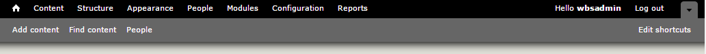

# Terms & Features
## Administration Menu Bar
When Logged in as a Site Manager or Content Creator the first bar at the top of the page is called the **Administration Menu Bar** and it allows users with the correct permissions to add/view/delete/edit content as well as other administration specific tasks.

## Blocks
Blocks are a method for positioning data within a page.

## Nodes
A node is the generic term for a piece of content on your web site. The content type of the node will define what fields are included with it. Depending on the type of node, different fields will be attached, and this is known as a content type. For example, a basic Page content type has attached fields such as title and body fields. Other examples of content type are: Book pages for use in Books, Discussion topics in forums, Blog pages in blogs, and News articles.

## Content Type
Every node belongs to a single *node type* or *content type*, which defines various default settings for nodes of that type, such as whether the node is published automatically and whether comments are permitted. Common *Content Types* that just about any website would have include: blog post and page. Content types can have different fields and modules can define their own content types. The core *Drupal* Book and News modules are two examples of modules that define content types.

### Site Architecture - Content Types The UoG Template Provides:
1. [Basic Page](features/howto-page.md)
    * The **Basic page** content type is used for static content that can (but are not required to) be linked into the main navigation bar. This is one of the most "basic" content types and can be very flexible.
2. [Featured Items](features/howto-featured.md)
    * The **Featured Item** allows content authors to create a lead-in to any page content on the website (e.g. Events, News, Basic Page, People Profiles, etc.) or an external URL.
3. [Banner](features/howto-banner.md)
    * The **Banner** feature provides editors with an image carousel at the top of the page which can feature multiple pieces of content.
4. [News](features/howto-news.md)
    * The **News** feature allows content authors to add news articles to the website and display them in a Listing Page view, an Article Detail Page view, and a Recent News Teaser List view. Any article can be featured on any page using the Featured News Article view. Site visitors can also browse for news articles by date and category tag.
5. [Events](features/howto-events.md)
    * The **Events** feature allows content editors to add events to the website and display them in a Listing Page view, a Weekly Events view, a Monthly Calendar view, an Event Detail Page view, and an Upcoming Events Teaser List view. Any event can be highlighted (or “featured”) on any page using the Featured Events block. Site visitors can also browse for events by date and event category.
6. [Social Media](features/howto-socialmedia.md)
    * The **Social Media** feature allows Anonymous Users to share pages on their favorite networks and visit a variety of (external) social media pages affiliated with the website. They can also access Twitter, Facebook and RSS feeds directly on the website.
7. [Services](features/howto-services.md)
    * The **Services** feature provides a method for outlining and featuring the services that you offer. Users can find Services alphabetically, by service category, or by audience (eligible user). They can also search for services by keyword (tags).
8. [FAQ](features/howto-FAQ.md)
    * The **Frequently Asked Questions (FAQ)** feature allows editors to create a repository of commonly asked questions and their corresponding answers.
9. [Book](features/howto-book.md)
    * The **Book** feature is a set of pages tied together in a hierarchical sequence, perhaps with chapters, sections, subsections, and so on. You can use books for manuals, site resource guides, Frequently Asked Questions (FAQs), or whatever you'd like.
10. [People Profiles](features/howto-profiles.md)
    * The **People Profiles** feature allows an authorized user to create and edit an organizational profile. Anonymous users can browse through these profiles in a Listing Page view and find more detail about a specific member of the organization in the Profile Detail Page view. Editors can highlight (or “feature”) any profile on any page using the Featured Profile view.
11. [Blog](features/howto-blog.md)
    * The **Blog** feature allows authorized users to maintain a blog. Blogs are a series of posts that are time stamped and are typically viewed by date as you would view a journal. Blog entries can be made public or private to the site members, depending on which roles have access to view content.
12. [Web Forms](features/howto-webforms.md)
    * The **Web Forms** feature is for making forms and surveys in *Drupal*. After a submission, users may be sent an e-mail "receipt" as well as sending a notification to administrators. Results can be exported into Excel or other spreadsheet applications.
13. [Landing Page](features/howto-landingpag.md)
14. [Special Alert](features/howto-specialalert.md)
15. [Course Outlines](features/howto-courseoutlines.md)
16. [Custom Content](features/howto-customcon.md)

## Field
*Fields* are elements of data that can be attached to a node or other *Drupal* entity. Fields commonly contain text, images, or terms.

## Input format
These are settings that define the filtering of user-entered text before it is displayed. This can be used to control formatting or malicious input.

## Menus
*Menus* refer to the navigation elements on a page, and to *Drupal's* internal system for handling requests. When a request is sent to *Drupal*, the menu system uses the provided URL to determine what functions to call.

There are four standard menus in *Drupal 7*:
1. **The Main Menu** is built by site administrators and displayed automatically in the page header of many themes (and if not, you can enable their blocks to display them).
2. **Management** is the Administration Bar Menu, and is presented as the first item at the top of the page for Content Creators and Site Managers.
3. **Navigation** is a catch-all menu that usually contains links supplied by modules on your site.
4. **User Menu** contains links to the User account and the logout link.

## Module
A module is software (code) that extends *Drupal* features and functionality. The University of Guelph supplies and maintains it's own modules for compliance with **AODA** - within this documentation they are generally called **Features**.

## Path
In *Drupal* terms, path is the unique, last part of the URL for a specific function or piece of content. For instance, for a page whose full URL is http://example.com/CCS/AODA, the path is CCS/AODA.

## Path Alias
This changes default paths such as node/7 into user-friendly paths such as about/contact. This is automated with UoG enabled modules.

## Taxonomy
*Drupal* has a system for classifying content known as taxonomy. This is provided by the core Taxonomy module. You can define your own vocabularies (groups of taxonomy terms) and add terms to each vocabulary. Each vocabulary can then be attached to one or more content types, and in this way, nodes on your site can be grouped into categories, tagged, or classified in any way you choose. Go to [the taxonomies page for more information.](taxonomies.md)

## Users, Permissions, and Roles
Every visitor to your site, whether they have an account and log in or visit the site anonymously, is considered a user to *Drupal*. Every user when created also has a role assigned to them, these roles grant the user certain permissions. When those users are logged in, *Drupal* will let them do the actions that role has permissions for.

### Types of UoG Users
#### Anonymous User
This is anyone visiting the website which is not logged in.
- Can view the front-end of the website.

#### Authenticated User
These users are assigned a user ID when they register for the website. A user name and email address is associated with any user that isn't anonymous (therefore must be logged in).
- Can log in to the back-end of the website.
- Can edit their own user profile.

#### Author
- Can create new content drafts.
- Can edit (their own) content drafts.
- Can view their content revisions.

#### Editor
Can view/edit all project data, create/edit all content types.
- Can edit any content (drafts or published).
- Can approve any content drafts for publishing.
- Can publish any content.

#### Site Manager
- Can change site layout.
- Can create/edit taxonomies.
- Can edit menus.
- Can edit any user profile.

## WYSIWYG
*WYSIWYG* is an acronym for *What You See Is What You Get*, used in computing to describe a method in which content is edited and formatted by interacting with an interface that closely resembles the final product. We use a WYSIWYG editor for adding main body content. [Read the guide on our WYSIWYG editor for helpful tips](wysiwyg-editor.md).
