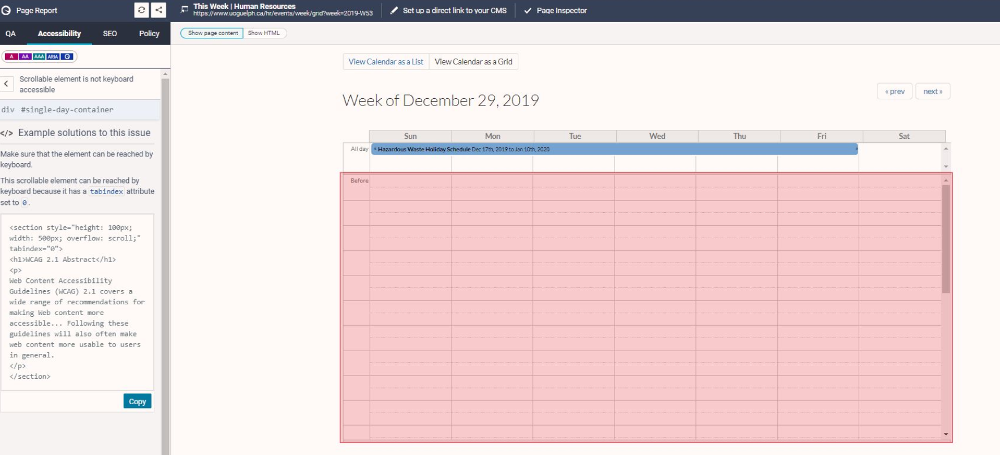

# Known Accessibility Issues 

These are known accessiblity issues which may appear in Siteimprove reports, and can be ignored for now.

## Scrollable element is not keyboard accessible

This issue occurs on Event pages, due to the alternate Calendar grid view. Normally, the List view is displayed first (the default).
The (inaccessible) grid is an alternative to the (fully accessible) list view (and therefore the feature as a whole is accessible.)
We are asking Siteimprove to override this issue so that it presents as a known issue but doesn't affect the accessibility score.

**Note**:  Site owners can ignore these Site Improve errors assuming they have not altered the default behavior. 

## Table Headers are not referenced correctly

This is a wide spread issue with the use of calendars for Events. Data tables can present a challenge especially if the table contains a lot of information.
Screen readers can only announce table data correctly if cells and headers are marked up correctly in the code.

Normally, the List view is displayed first (the default). The (inaccessible) grid is an alternative to the (fully accessible) list view 
(and therefore the feature as a whole is accessible.) We are asking Siteimprove to override this issue so that it presents as a known issue
but doesn't affect the accessibility score.

**Note**:  Site owners can ignore these Site Improve errors assuming they have not altered the default behavior. 
