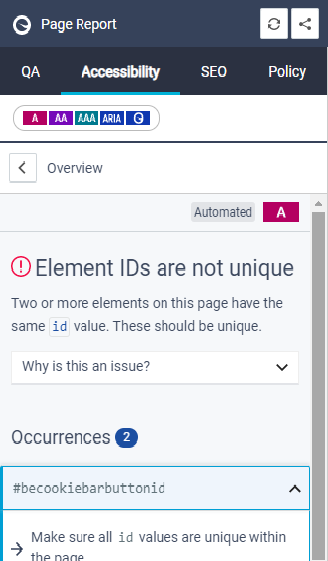

# Known Accessibility Issues 

These are known accessiblity issues which may appear in Siteimprove reports, and can be ignored for now.

## BrightEdge cookie (#becookiebuttonbarid)

This issue can only be fixed by BrightEdge and in the meantime you can ignore this error.

## Scrollable element is not keyboard accessible

This issue occurs on Event pages, when using the Calendar view. We are asking Siteimprove to override this issue so that it presents as a known issue but doesn't affect the accessibility score.

**Note**: To avoid this issue, use the Event listing view (which is the default), instead of the Calendar view.

