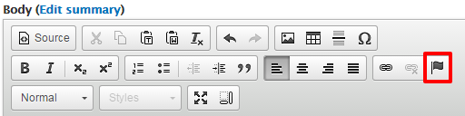
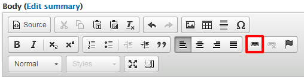

# Links

* [Accessible Links](links.md#accessible-links)
* [External Links](links.md#external-links)
* [Internal Links](links.md#internal-links)
* [Email Links](links.md#email-links)
* [Anchor Links](links.md#anchor-links)

## Accessible Links

When adding links to a page, ensure that the user can determine the destination of the link. Avoid using ambiguous terms like "here," "more," or "this" for link text. Instead, use descriptive link text to help users with assistive technology understand the context and destination of the link. For example, instead of "click here" use something like "more information on \[topic\]."

## External Links

An external path is any link that is NOT under www.uoguelph.ca/_yourSiteName_.

1. In the Drupal text editor, highlight your chosen link text.
2. Select the link button. This will open the Link dialog box. 
3. Ensure that the "link type" dropdown menu is set to `URL`.

   

4. Paste the link where you would like this text to hyperlink to \(Eg:www.google.ca\) in the "URL" field.
5. Select `OK`.

## Internal Links

An internal path is any link that is under www.uoguelph.ca/_yourSiteName_

1. In the Drupal text editor, highlight your chosen link text.
2. Select the link button. This will open the Link dialog box.
3. Ensure that the "link type" dropdown menu is set to `internal path`.

   

4. Search for the internal page by typing the first few characters of the page name in the "Link" field.
5. Select the page you want to link from the list of suggestions.

   

6. Select `OK`.

## Email Links

Upon selection, an email link will prompt the user to email the specified address is MS Outlook.

1. In the Drupal text editor, highlight your chosen link text.
2. Select the link button. This will open the Link dialog box.
3. Ensure that the "link type" dropdown menu is set to `E-mail`.

   

4. Enter the email address you would like this text to hyperlink to.
5. If applicable, enter the email subject and message body into their respective fields.
6. Click `OK`.

## Anchor Links

Anchor links are links that will take the user to a specific spot on the same page.

1. In the Drupal text editor, highlight some text to be used as the anchor \(the spot the link will jump to\). 
2. Select the anchor button \(flag icon\). This will open the Anchor Properties dialog box.

   

3. Enter a name for the anchor. Select `OK`.

   

4. Highlight text to be used as the link.
5. Select the link button \(chain link icon\).

   

6. The Link dialog box will open. Under link type, select "link to anchor in the text."
7. Using the "By element ID" drop-down menu, select the anchor's name. It is important that the anchor is selected by element ID and not by name. Select `OK`.

   

