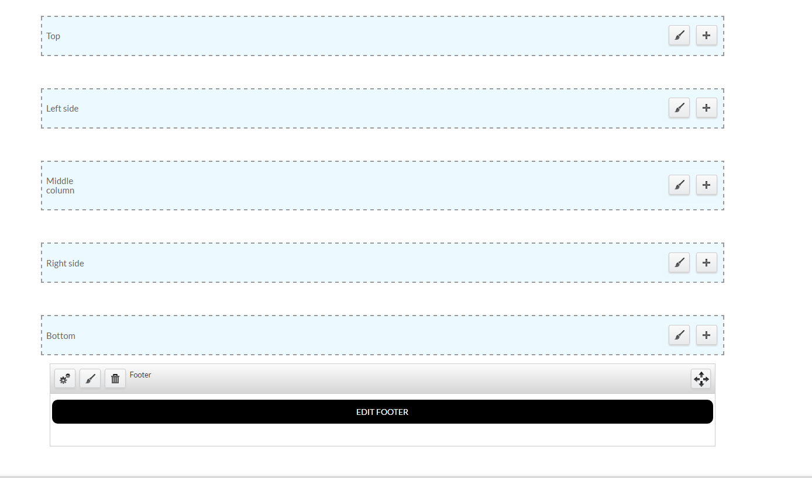
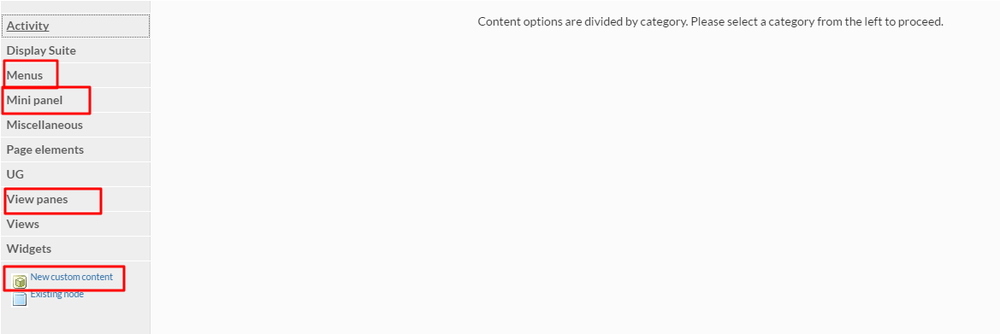
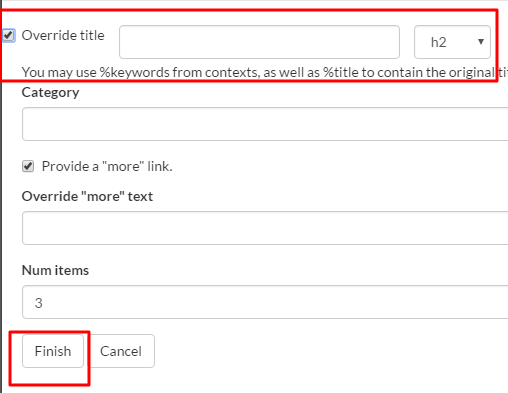

# Customizing Content Layout

## Adding view panes

1. In order to customize the way a page appears, select the `Customize this page` option that appears at the bottom of your screen. _Please note:_ **Only Site Managers** have access to this option.
   * 
2. Select the preferred side/column where you would like a "view pane" to be visible, then select `+`.
   * 
3. There are several content options listed that can be added to the page:
   1. Menus - includes any menus that you created or are present by default.
   2. Mini Panels - includes footer and other mini panels created by you.
   3. View Panes - includes the different formats the content types can appear in. The most commonly used are the _Teaser Lists._
   4. New Custom Content - includes adding any customized content that will suit your needs.
      * 

## Configure a view pane

Each view pane permits content creators to configure the view panes in many ways:

### Override the title:

1. If you would like to add a title to your view pane, select `Override Title`.
2. Select `Finish`.
   * 
3. Select the _Settings_ option on the view pane and then type in your customized title.
4. Then, Select `Finish` again.
   * 

### Adding a "More" Button:

1. Select the `Provide a "more" link` option.
2. Type in some descriptive "more" text that indicates where the link is going \(ex. More Features\).
3. Select `Finish`.
   * 

### Categorizing view panes:

Taxonomy is used to categorize content so it is visible in desired locations. If you would like to categorize your view pane by using taxonomy:

1. Ensure the content type has a category.
2. Note down the **term number** that the category is associated with. The **term number** is located in the url on your screen \(ex. [https://.../term/109/](https://.../term/109/)...\).
3. Add the **term number** to the `Category` space, when configuring your view pane.
4. Select `Finish`.
   * 

_Always_ `save` _the page when you are done customizing._

