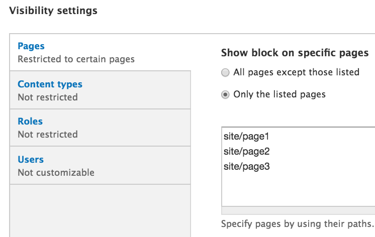

# Blocks

1. Scroll to the bottom of the page and click `Customize this page`
   * Click on `Left side`
     * Select Region Style \(Paint Brush\)
     * Ensure **Style** is **Bootstrap** and click `Next` button
     * Change **Column size** to **--None--**
     * Change **Offset size** to **--None--**
   * Click on `Middle Column`
     * Select Region Style \(Paint Brush\)
     * Ensure **Style** is **Bootstrap** and click `Next` button
     * Change **Column size** to **12**
     * Change **Offset size** to **--None--**
   * Click on `Right side`
     * Select Region Style \(Paint Brush\)
     * Ensure **Style** is **Bootstrap** and click `Next` button
     * Change **Column size** to **--None--**
     * Change **Offset size** to **--None--**
2. In the top menu, click `Structure`
   * To view block regions:
     * Click **Demonstrate block regions \(UG Cornerstone Theme\)** at the top
     * You will see a screen similar to the one below appear. Each block region will be listed and highlighted in yellow 

       
   * To add blocks:
     * You can scroll down to the **Disabled** Blocks region and add a block of your choice to a selected region
     * To create a new block click on `Add block`
     * Fill out the fields

       **Initial Block Settings**

       * **Block title:** Enter a title for your block. If you enable the option to show a title for your block, this is what will show.
       * **Block Description:** Used to help identify this particular block. If you had several blocks for example, unique descriptions will help you organize and manage your blocks. **Block body:**  What you’re showing

       **Region Settings**

       * Setup where your block will appear

       **Visibility Settings**

       * **Pages:** allows you to restrict which pages this block will be displayed in      
       * **Content types:** allows you to control which content types this block will appear with
   * Click `Save block` at the bottom of the page
   * If you wish to configure the blocks, you may do so after saving the blocks
     * Configuring a block allows you to edit the contents of the block, and deal with the visibility settings

**2.1 Creating your Block** 

**2.2 How it will appear on your site \(Placed in Primary Region\)** 

## Common Usage for Blocks

1. Display Menu on Specific Pages
   * Follow steps 1 and 2 under "How to Create a New Block" before completing the following steps.
   * When creating a new block, select Add Menu Block instead of Add Block.

     

   * Fill out the Block Title and Administrative Title.
   * Select the menu you would like to display \(based on the assumption the menu you would like to display already exists\).
   * Select starting level.
   * At the bottom, select what pages you would like the menu to display on.

     
2. Display Image/Logo on Specific Pages

   Follow the above steps with these steps in mind.

   

   * Follow steps 1 and 2 under "How to Create a New Block" before completing the following steps.
   * Leave the title of the block empty.
   * Put the image, with appropriate alt text, in the block using the Drupal Text Editor.
   * At the bottom, select what pages you would like the menu to display on.

     

