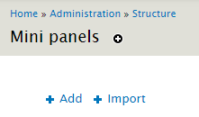

# Mini Panel

* [Creating a mini panel](howto-minipanels.md#creating-a-mini-panel)
* [Configure Mini Panels to appear on a page or homepage](howto-minipanels.md#configure-mini-panels-to-appear-on-a-page-or-homepage)
* [Activating Mini Panels under blocks](howto-minipanels.md#activating-mini-panels-under-blocks)

Mini panels are portable panels with 2 or 3 columns that display many types of content \(custom content, view panes, menus, etc.\) Once a mini panel is built it can then be placed as a block in any region of your site.

## Creating a mini panel

1. Click on `Structure` in the Administration menu bar and select `Mini panels` 
2. Click `+` Add

   

3. Under Administrative title, enter a unique name for your mini panel. Click `Continue`.
4. Click `Continue` again \(to skip the Context menu\) and then select **Two Columns Stacked** and click `Continue`.
5. Select **Two Columns Stacked** or **Three Columns Stacked** depending on how many columns you need. Click `Continue`.
6. You can enter a title if you like, unless select the **No title** option under **Title type**.
7. Click on the gear  button for the section you would like to add content to and select `Add content`
8. Select **New custom content**
9. The WYSIWYG editor will open. Add a **title** and add content to the **body** section
10. Click `Finish`
11. Repeat steps 9 – 12 for all other sections you would like to add content to
12. Once sections have been filled, click on the gear  on each section and do the following:
    * Select `Change` under **Style**. In the menu that pops up, select **Bootstrap**. Select `Next`.
    * Change Column Type to Small & medium devices. Change Column sizes \(_They must add up to 12_\). Set Offset size to none. Click `Save`.
13. Click `Save`.

**/! Note**: Please note that this mini panel will not appear anywhere on your site until it’s activated under Blocks or added to a page.

## Configure Mini Panels to appear on a page or homepage

1. Click the `Home button` in the Administration menu bar.
2. Once on the home page, click `Customize this page` \(found at bottom of your screen\).
3. Under the **Top** or **Bottom** section, click `+` and select `Mini panel`.
4. Under Mini panel, select the title of the mini panel you created. Click `Finish`.
5. Click `Save` at the bottom of the screen.

**/! Note**: Please note that if you use this method to add mini panels to a page it will show up on all your pages. If you add it the homepage it will show up on only the homepage.

## Activating Mini Panels under blocks

1. Click on `Structure` in the Administration menu bar and select `Blocks`.
2. Scroll down under the Disabled section of the list and look for your mini panel title it should be in the format: \*\*Mini panel:

   “Mini panel name”\*\*.

3. Click `configure`.
4. In the `Region Settings` section select **Content** from the drop-down list.
5. At the bottom of the page select the radio button option for **only the listed pages**
6. Enter the node number\(s\) of the page you would like the mini panel to appear on. With the format: node/number 

   \(_node number can be found in the URL of the edit page section_\)

1. Click `Save block`.

