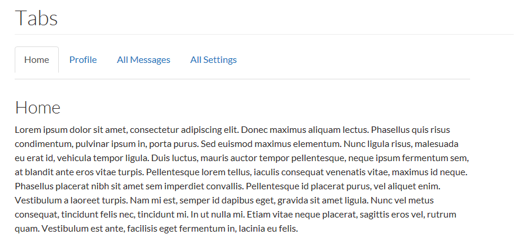
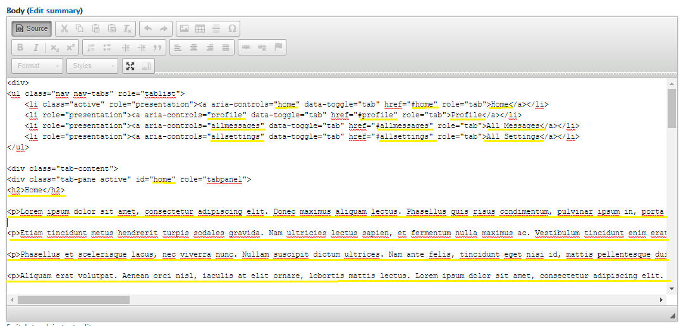

# Tabs



Tabs organize content into meaningful sections, while occupying less screen space. Use tabs to give readers quick access to sections of a long document or page, such as profile pages.

To create tabs in your content: 1. Click the _Source_ button on the editor toolbar


1. Copy and paste the following markup
2. Edit the number and description of the tabs to suit your content



## Markup

```text
<div>
  <!-- Nav tabs -->
  <ul class="nav nav-tabs" role="tablist">
    <li role="presentation" class="active"><a href="#(addname)" aria-controls="(addname)" role="tab" data-toggle="tab">(Add Name)</a></li>
    <li role="presentation"><a href="#(addname)" aria-controls="(addname)" role="tab" data-toggle="tab">(Add Name)</a></li>
    <li role="presentation"><a href="#(addname)" aria-controls="(addname)" role="tab" data-toggle="tab">(Add Name)</a></li>
    <li role="presentation"><a href="#(addname)" aria-controls="(addname)" role="tab" data-toggle="tab">(Add Name)</a></li>
  </ul>
  <!-- Tab panes -->
  <div class="tab-content">
    <div role="tabpanel" class="tab-pane active" id="(addname)">(Add content)</div>
    <div role="tabpanel" class="tab-pane" id="(addname)">(Add content)</div>
    <div role="tabpanel" class="tab-pane" id="(addname)">(Add content)</div>
    <div role="tabpanel" class="tab-pane" id="(addname)">(Add content)</div>
  </div>
</div>
```

