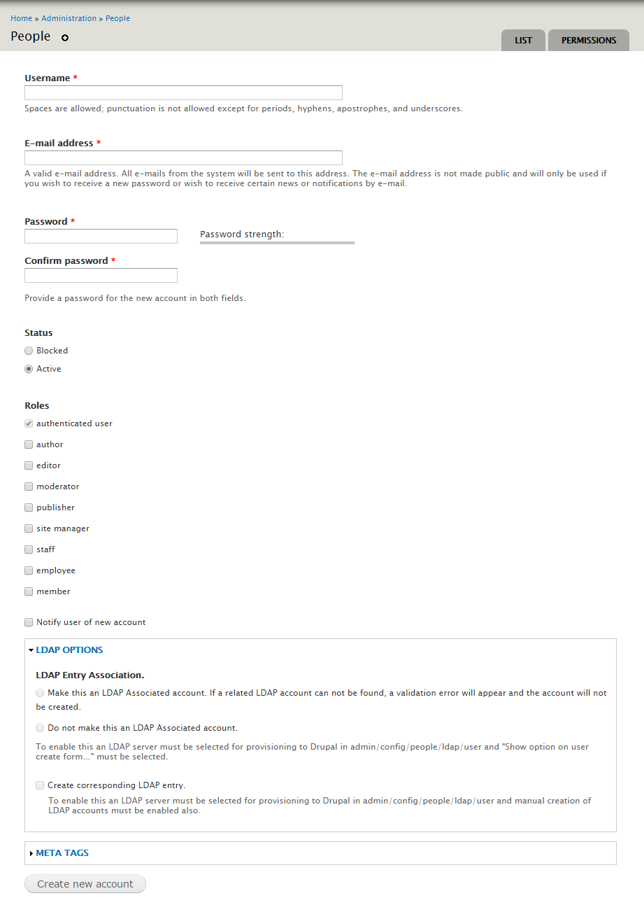
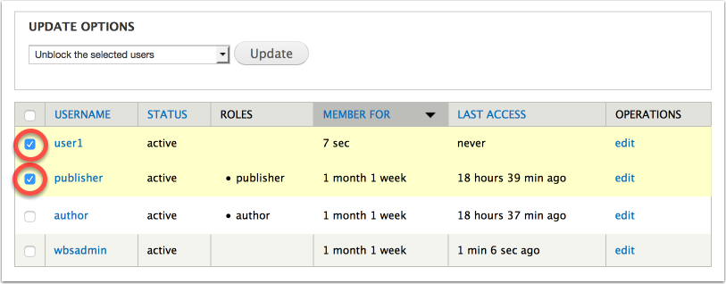
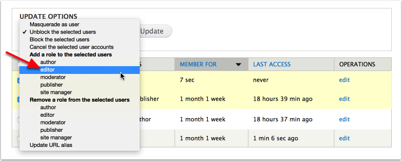

# Drupal Websites: Getting Started

This guide is designed to help those who are just starting their journey with the UG Drupal platform. If you require more advanced information and how to use specific content types, please check out the [UG Drupal Content Types](../ugcontenttypes/) section or the [Advanced Guide to Drupal Websites](../advancedguide/) section of the training module.

This guide will cover:

* [How to Login/Logout](./#logging-in)
* [Introduction to the Admin Menu Bar](./#introduction-to-the-admin-menu-bar)
* [Creating Basic Content](./#creating-basic-content)
* [Editing Pre-existing Content](./#editing-pre-existing-content)
* [Adding Users to the Website](./#adding-users-to-the-website)
* [WYSIWYG Editor](wysiwyg-editor.md)
* [Managing Menus](menuitems/)
* [Taxonomies](taxonomies.md)

## How to Log in/Log out

### Logging In

1. Navigate to your website: www.uoguelph.ca/_sitename_/user. Once there, you will be brought to the following page:

   

2. Enter your Central Login ID in the "Username" field.
3. Enter your Central Login Password in the "Password" field.
4. Select `Log in`.

### Logging Out

There are many ways in which a user can log out. The simplest way is to click the `Log out` option located on the menu bar.

## Introduction to the Admin Menu Bar

When logged in as a Site Manager or Content Creator, the first bar at the top of the page is called the **Administration Menu Bar** and it allows users with the correct permissions to add/view/delete/edit content as well as other administration-specific tasks.

On the Admin Bar, the important features to note are:

* **House Icon**: When selected, the user will be brought to the home page.
* **Content**: When selected, the user will be brought to a table in which all content types are listed and availiable for selection.
* **Structure**: When selected, the user will be brought to a list of content types in which they can edit the overall structure of those types.
* **People**: When selected, the user will be brought to a table in which all users registered with the site are listed.

## Creating Basic Content

In order to publish content on your website, you must select a content type in which this new content should be displayed. Once you have selected the content type in which to put your content, the rest is easy.

There are a few ways to add content to your website:

### Option 1

Select the `Add Content` shortcut located in the Administration Bar. 

### Option 2

Select the `Content` button in the Administration Bar and then selecting the `Add Content` option.

Both Option 1 and Option 2 will bring you to the "Add Content" menu.

From this step, select the content type in which you would like to add content. For more information in regards to each content type, please visit the [UG Drupal Content Types](../ugcontenttypes/) section.

## Editing Pre-existing Content

All content created on your website can be viewed by selecting the `Find Content` shortcut located in the Administration Menu shortcut bar, or by selecting `Content` in the Administration Bar itself. 

Once selected, you will be brought to a page with the content listed in a table. 

You can search for specific content through the "SHOW ONLY ITEMS WHERE" filter options. Use the drop-down menus to filter by content status and type to find what you're looking for. 

## Adding Users to the Website

Arguably the most straight forward way to add users to a website is to ask the user to log in to the site using their Central Login-ID and password \(see [How to Login](./#how-to-log-inlog-out)\). By doing this, the user is added into the system as an authenticated user of the website. Once a successful login has occurred, the user can be assigned roles by a site manager adding user roles \(see [Managing User Roles](./#managing-user-roles)\).

What if the user doesn't have a Central Login-ID or if the user is unable to login? Alternatively users can be added by an individual with the site manager role. If you already know the Central Login-ID and email address, or the user is not U of G authenticated, accounts can be set-up without having the user attempt the intial login.

### Adding a New User

1. At the top of the Administration Menu Bar select `People`.
2. Select `Add User`.
3. Under the "Role" category, select the roles you would like the user to have. 
   * All Unchecked \(Except Authenticated User\): User is a normal user with no content creation/editing capabilities.
   * For more information on the user roles, please visit the [Drupal User Roles and Responsibilities](../rolesandresp.md) section.
4. For the sake of saving the information you just edited, enter a _random_ password in the "Password" and "Confirm Password" field. This step is purely for the sake of saving. This password is **NOT IMPORTANT**!!! It will not be retained since the User's Central Login ID and Password will override and provide that user access to the website.
5. Leave the LDAP Options section blank.
6. Select `Save`.

### About User Roles

In Drupal, access and permissions are granted to defined user roles. User roles are in turn assigned to individual users. The U of G Drupal platform has the following predefined roles each with unique permissions allowing for different types of users with different limitations on tasks they are premitted to perform:

* Anonymous User
* Authenticated User
* Author
* Editor
* Publisher
* Site Manager

If you are not familiar with types of users \(or user roles\) you can review the [Types of UoG Users](../drupal_features_terms_acroynms.md#types-of-uog-users) in the Drupal Platform Introduction.

### Managing User Roles

**Note:** The ability to manage user roles is restricted to Site Managers.

#### Changing Roles for One User

1. At the top of the Administration Menu Bar select `People`.

   

2. Locate the appropriate user you would like to change roles for. You can do this by either using the filter provided, scrolling through the list, or using the in-browser search feature \(ctrl + f\).
3. Once the user is located, select `edit` for that user.

   

4. Under the "Role" category, select or deselect the roles you would like the user to have.
   * All Unchecked \(Except Authenticated User\): User is a normal user with no creation/editing capabilities.
   * For more information on the user roles, please visit the [Drupal User Roles and Responsibilities](../rolesandresp.md) section.
   * In the example below we are adding the roles 'editor' and 'publisher' for the user.

     
5. Select `Save`.

**Note:** Ignore the password field for edits - if left blank the password remains unchanged which is desired in most cases.

#### Changing Roles for Multiple Users

1. At the top of the Administration Menu Bar select `People`.

   

2. Select all the individuals you wish to change the roles.

   

3. From the Update Options dropdown menu select the new role you wish to add to all selected users. For the example below the role of 'editor' is being added.

   

4. Select `Update`.

#### Additional Resource

* Lynda.com video turtorial - [Drupal 7 Essential Training: Defining user roles](https://www.lynda.com/Drupal-tutorials/Defining-user-roles/73655/78828-4.html?org=uoguelph.ca)

## Common Web Errors

When creating, editing, or managing content with the Drupal platform there are a few common web errors to look out for. These web errors are not only found on our Drupal platform, so it's benificial to know and understand their causes. These common web errors include:

* **Error 404**: This error arises when the URL you have navigated to points to something that does not exist. Common causes of this error are typos in the URL provided when clicking a link, or deletion/non-existance of the node that the URL links to. To fix these problems, simply update the link with the correct one, create the page the link points to, or add a URL Alias to a page that should have this link but does not.
* **Error 403**: This error arises when the user does not have permission to access the URL they have navigated to. Common causes of this error are unauthenticated users \(users not logged in to the website\) trying to access webpages that are either unpublished or private. Pages that are private may also limit access to specific types of users through their authentication privileges.
* **Error 500**: This error arises when the webpage you have navigated to has problems connecting with its back-end server. This is most commonly seen from a content creator/editor and site manager point of view. Common causes of this error are timing out \(more common\) or input of incorrect information during critical periods \(less common\). To fix this error, simply refresh the page. If the error persists, ensure that the data you are inputting is correct, then contact your Web Manager/Site Owner.

