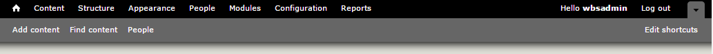

# Admin Menu Bar

## Introduction to the Admin Menu Bar

When logged in as a Site Manager or Content Creator, the first bar at the top of the page is called the **Administration Menu Bar** and it allows users with the correct permissions to add/view/delete/edit content as well as other administration-specific tasks.

On the Admin Bar, the important features to note are:

* **House Icon**: When selected, the user will be brought to the home page.
* **Content**: When selected, the user will be brought to a table in which all content types are listed and availiable for selection.
* **Structure**: When selected, the user will be brought to a list of content types in which they can edit the overall structure of those types.
* **People**: When selected, the user will be brought to a table in which all users registered with the site are listed.
