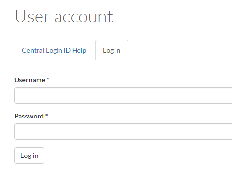

# How to Log in/Log out

### Logging In

1. Navigate to your website: www.uoguelph.ca/_sitename_/user. Once there, you will be brought to the following page:

   

2. Enter your Central Login ID in the "Username" field.
3. Enter your Central Login Password in the "Password" field.
4. Select `Log in`.

### Logging Out

There are many ways in which a user can log out. The simplest way is to click the `Log out` option located on the menu bar.
