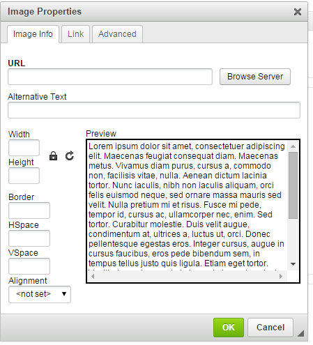
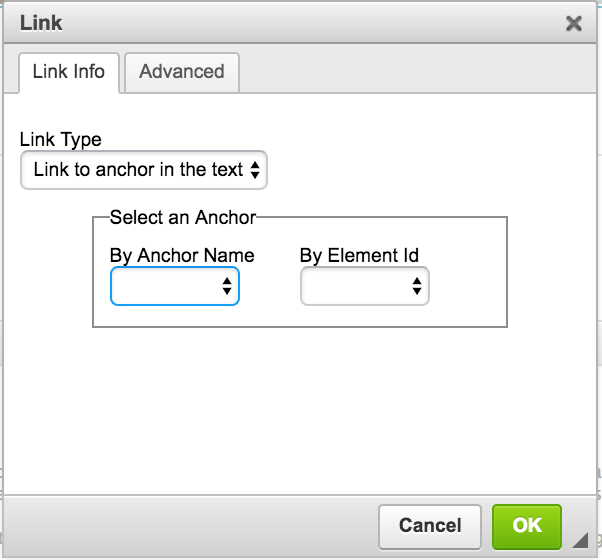
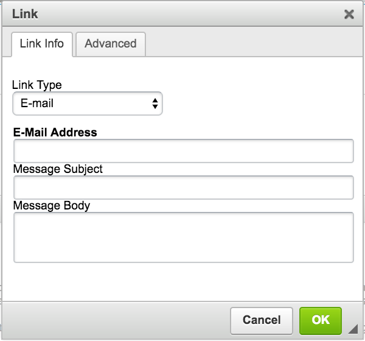

# Drupal Text \(WYSIWYG\) Editor

Drupal provides its users with a simple text editor that is universal amongst all content types. The Drupal Text Editor \(A.K.A the WYSIWYG Editor\) allows users to add custom content to the page through its collection of tools. _WYSIWYG_ stands for "What You See Is What You Get."

Here is what the Drupal Text \(WYSIWYG\) Editor's operations look like: 

## Buttons on the Drupal Text \(WYSIWYG\) Editor

### First Row

* **Source**: Allows the user to input raw HTML and CSS. Commonly used for adding content from the [Style Guide](../styleguide.md) into your content.
* **Cut \(Scissors\)**: Acts like a basic cut functionality in MS Word.
* **Paste \(Papers\)**: Acts like a basic paste functionality in MS Word.
* **Paste as Plain Text \(Clipboard with T\)**: Pastes entered content into the editor and removes **ALL** text styling.
* **Paste as "Plain Text" from Word \(Clipboard with W\)**: Pastes entered content into the editor and removes text styling but keeps formatting.
* **Remove Existing Text Formatting \(Tx\)**: Removes styling from selected text.
* **Undo & Redo \(Arrows\)**: Undo/Redo the most recent action done in the editor.
* **Insert Image \(Image Icon\)**: Allows the user to insert an image.
* **Insert Table \(Table Icon\)**: Allows the user to insert a table.
* **Insert Thematic Break \(Horizontal Line\)**: Produces a horizontal line in your content. Most commonly used for separating different sections within a page. 
* **Insert Special Character \(Omega Symbol\)**: Allows the user to insert special characters and symbols into the page.

### Second Row

* **Bold & Italics \(B and I\)**: Bold and Italicize selected text.
* **Subscript and Superscript**: Subscript and superscript text.
* **Numbered List \(Numbered List Icon\)**: Create a numbered list or place selected items into a numbered list.
* **Unordered List \(Unordered List Icon\)**: Create an unordered list or place selected items into an unordered list. 
* **Decrease Indent**: Decrease an existing indent on selected text.
* **Increase Indent**: Indent selected text.
* **Insert Block Quote \(Quotation mark\)**: Create a block quote or place selected information into a block quote. For more information on block quotes check out the [Official Bootstrap Style Guide](http://v4-alpha.getbootstrap.com/content/typography/#blockquotes).
* **Text Align \(Left, Center, Right, Justify\)**: Align selected text.
* **Create Hyperlink \(Chain link icon\)**: Allows the user to hyperlink selected text.
* **Remove Hyperlink \(Chain link icon with x\)**: Allows the user to remove a hyperlink from text.
* **Create Anchor \(Flag\)**: Allows the user to create a text anchor. More information about anchors below.

### Third Row

* **Text Sizing Dropdown Menu**: Allows the user to place the selected text into headings. This should not be used for font sizing and should only be used to mark correct headings as headings.
* **Image Styles Dropdown Menu**: Allows images to be aligned left, centred, or aligned right.
* **Full Screen Text Editor**: When selected, the Drupal Text Editor will expand and take up the entire screen. Select again to close.
* **Show Blocks \(Vertical and Horizontal Lines\)**: Allows the user to see the different code blocks within the Drupal Text Editor.

## Inserting an Image

1. Ensure that the location you are trying to add the image to is correct.
2. In the respective Drupal Text \(WYSIWYG\) Editor, click on the image icon.

   

3. On the new popup window, select `Browse Server`. If the image is already uploaded, then proceed to step 5.

   

4. Uploaded the image to the website file system by selecting `Upload` from the menu bar. Upload the file and select the appropriate settings, then select `Upload`.

   

5. Locate the image you would like to insert. Then, select `Insert File` on the menu bar.
6. Ensure that you give the image appropriate alternative text. For more information on appropriate altetnative text, please visit [the  WebAIM turotial on alternative text](http://webaim.org/techniques/alttext/).
7. Once your image has been selected and the appropriate alternative text has been added, insert the image by selecting `OK`.

## Create and Delete Sub-Directories

The users can create and delete sub-directories under the **root/uploads** directory only. Make sure that the **uploads** directory/sub-directory is selected/highlighted.

## Inserting a Table

The **WCAG 2.0** standard for table settings dictates that table markup must be properly structured to differentiate and properly link between header and data cells.

1. Ensure that the location you are trying to add the table to is correct.
2. In the respective Drupal Text \(WYSIWYG\) Editor, click on the table icon.

   

3. In the new popup window, enter the number of columns \(vertical\), and rows \(horizontal\), in their respective input fields.
4. If your table requires table headers, select the appropriate markup using the "Headers" dropdown menu. For more information about table headers, please visit [the WebAIM tutorial on tables](http://webaim.org/techniques/tables/data).
5. Add a `Caption` if a title is not provided elsewhere. A caption will act as a title above a table.
6. Adding a `Summary` is optional, but recommended if the table is complicated and the information is not provided elsewhere.

   

7. Upon completing the above steps, select `OK`. Once selected, the table should be inserted into the text area of the editor. You may proceed to insert the information into the table.

**/! Note**: To modify an existing table, right-click on a cell in the table and additional options will be displayed.

## Creating and Removing Hyperlinked Text/Images

The **WCAG 2.0** standard for links dictates that the purpose of each link can be determined by the link text alone \(AAA\), or by the link text and its surrounding context \(AA\).

**Example** Do not use:

> To search the internet click [here](https://www.google.ca).

Use this format instead:

> [Visit Google's homepage](https://www.google.ca).

1. Ensure that the location you are trying to add the hyperlinked text to is correct.
2. In the respective Drupal Text \(WYSIWYG\) Editor, highlight the text in which you are trying to hyperlink.
3. Once the text has been highlighted, select the hyperlink button on the Drupal Text Editor.

   

4. On the popup window, Specify the link type by selecting one of the options in the dropdown menu:
   * **Internal path**: Any link that is under www.uoguelph.ca/_yourSiteName_
     * Ensure that the "link type" dropdown menu is set to `internal path`.

       

     * Search for the internal page by typing the first few characters of the page name in the "Link" field.
     * Select the page you want to link from the list of suggestions.

       

     * Once completed, select `OK`.
   * **URL \(External Path\)**: Any link that is NOT under www.uoguelph.ca/_yourSiteName_
     * Ensure that the "link type" dropdown menu is set to `URL`.

       

     * Paste the link where you would like this text to hyperlink to \(Eg: [https://www.google.ca](https://www.google.ca)\) in the "URL" field.
     * Once completed, select `OK`.
       * **Link to Anchor in Text**: This option can be used to direct the user to a pre-existing anchor on the page.
     * Ensure that the "link type" dropdown menu is set to `Link to Anchor in the Text`.

       

     * Select the anchor you would like this text to link to by selecting the anchor name from the "By Element ID" dropdown menu.
     * Once completed, select `OK`.
       * **Email**: Hyperlink text to an email address that, upon selection, will prompt the user to email the specified address.
     * Ensure that the "link type" dropdown menu is set to `E-mail`.

       

     * Enter the email address you would like this text to hyperlink to.
     * If applicable, enter the email subject and message body into their respective fields.
     * Once completed, click `OK`.

