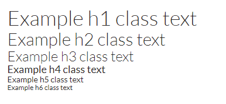

# Boostrap Classes: Typography

Bootstrap is an open-source front-end framework that is used to create responsive webpages.

The Typography classes allow you to style your content beyond default settings. Bootstrap has a global default font size of 14px. 

Example classes and elements include:

* `.lead`: creates larger, emphasized text
* `.h1` - `.h6`: creates text that mimics the appearance of headings
* `.small`: creates lighter, secondary text
* `<mark>`: creates highligted text
* `<del>` and `<s>`: creates text with a strikethrough
* `<ins>` and `<u>`: creates underlined text
* `<strong>`: creates bold text
* `<em>`: creates italicized text

## Lead

Lead is a class that can emphasize text. This is very useful when you would like to draw the user's attention to a piece of text that is not a heading. To ensure content is accessible, avoid using heading tags soley to make text appear larger. Heading tags should also be used in logical order.

To implement Lead, add `class="lead"` to an HTML element:

`
Example text.
`

What Lead looks like, compared to unstyled text and an `<h2>` heading:

> 

## Bootstrap Headings

Bootstrap heading classes (`.h1` - `.h6`) create text that has the same visual effect as heading tags. Like Lead, use these classes for inline text that is not a heading, but needs to be emphasized. 

To implement heading classes, add `class=h[numeral between 1 and 6]` to an HTML element:

`
Example h1 class text
`

`
Example h2 class text
`

`
Example h3 class text
`
 
`
Example h4 class text
`

`
Example h5 class text
`

`
Example h6 class text
`

What heading classes look like:

> 

