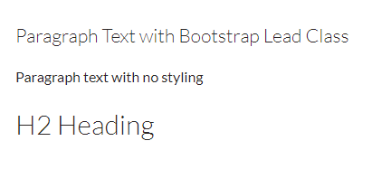

# Boostrap Classes: Typography

Bootstrap is an open-source front-end framework that uses HTML, CSS, and Javascript to create responsive webpages. Bootstrap is used to build themes and templates.

The Typography classes allow you to style your content beyond default settings. Bootstrap has a global default font size of 14px.

Example classes and elements include:

* `.lead`: creates larger, emphasized text
* `.h1` - `.h6`: creates text that mimics the appearance of headings
* `.small`: creates lighter, secondary text
* `<mark>`: creates highligted text
* `<del>` and `<s>`: creates text with a strikethrough
* `<ins>` and `<u>`: creates underlined text
* `<strong>`: creates bold text
* `<em>`: creates italicized text

## Lead

Lead is a class that can emphasize text. This is very useful when you would like to draw the user's attention to a piece of text that is not a heading. To ensure content is accessible, avoid using heading tags soley to make text appear larger. Heading tags should be used in logical order and only when they head content.

To implement Lead, add `class="lead"` to an HTML element:

> `
Example text.
`

What Lead looks like:

> 

## Bootstrap Headings

