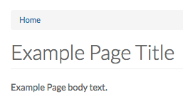
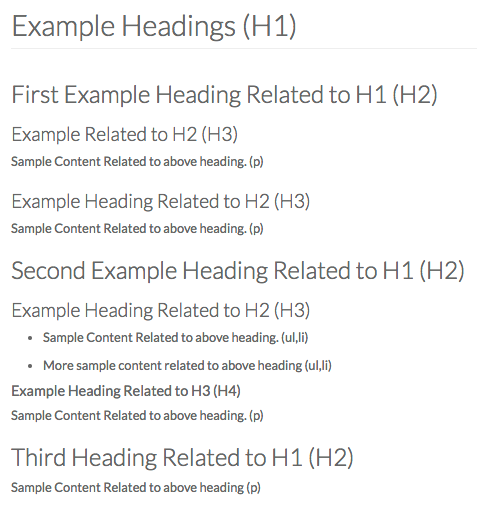
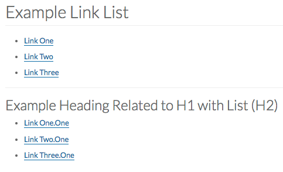

# Content Creators & Content Editors
As a **Content Creator or Content Editor** you must familiarize yourself with the normative criteria of [WCAG 2.0](https://www.w3.org/TR/WCAG20/). Content Creators and Content Editors are responsible for ensuring the accessibility of any web content that they upload or publish on the website. In many cases the Drupal Platform will cover the basic WCAG 2.0 Criteria but it is up to the Content Creator/Content Editor to ensure that the content they produce is WCAG 2.0 compliant.

## Guidelines to Making Content Accessible

### Content Titles
As part of the UG Drupal platform, every content type you create requires a title in order for the content to be successfully created. This specific field for this is called 'Title.' It is important that this title is descriptive enough of what the content is about but not too long. The title is the first thing that is shown on each page and it gives the user a general understanding of what the content below is about. A simple example of a content title is the title at the top of a basic page.

### Text
When writing text for web pages, consider the fact that some users cannot get an overview of a page visually, as opposed to structurally. Make sure that pages are divided into logical sections, each with a heading that is descriptive of the section. You can use several levels of headings: Heading 2, Heading 3, etc., so that assistive technologies can render them as headings.

Because of low vision some users will perceive a web page very differently to the way other users would visually perceive it. Therefore, make sure not to give important information solely by the use of colour or with an instruction requiring sensory skills. For example, avoid writing only things like: …you can read more about the event in the blue box to the right’. It is fine to write something like this if you supplement it with something that all users can find, such as an additional text: 'you can read more about the event in the blue box to the right with the heading Events in March.' This way you are also giving text that all users will be able to find.

**/!\ Strong Recomendation**: The AODA Team strongly suggests that headings be used in successive order. This means that any headings related to the Overall Page title (h1) start with h2 and then follow in order. Picture example below:

### Links
When adding links to a page there are two things that you should keep in mind:

1. Ensure that the user knows where they are going upon clicking the link. Avoid using ambiguous terms like [Click Here], [More] or [This]. We suggest using descriptive link text (number 2) as users with screen readers have the ability to gather all links on the page into a list.

2. Ensure that the link text is descriptive. Descriptive link text not only helps users with a screen reader understand the context of the link but also the average user as well. Descriptive link text allows the user to know where they are going upon clicking the link. For example instead of "Click Here" you can use "read more about this topic here".

**/!\ Strong Recomendation**: The AODA Team strongly suggests that when adding links to the page, do not paste the raw URL on the page. By "raw URL" we mean the "https://www.this.com/this/is/an/example" because the screen reader will read the entire link which is annoying. Not only is it annoying but if the link is a random sequense of numbers and letters then the user does not know where the link goes.

### Colours
When using colour in your website you must keep in mind two main points.

1. Colour is not used as the only visual means of conveying information, indicating an action, prompting a response, or distinguishing a visual element. For example, a calendar that only shows what day it is by highlighting the day in green would fail the standard due to there being no other way of knowing what day it is other than through visual representation.

2. The colour that is used in the text or image has the correct contrast ratio.
    * **Small Text & Images**: Small-scale text and images of small-scale text have a contrast ratio of at least 4.5:1.
    * **Large Text & Images**: Large-scale text and images of large-scale text have a contrast ratio of at least 3:1;
    * **Incidental**: Text or images of text that are part of an inactive user interface component, that are pure decoration, that are not visible to anyone, or that are part of a picture that contains significant other visual content, have no contrast requirement.
    * **Logotypes**: Text that is part of a logo or brand name has no minimum contrast requirement.

**/!\ Note**: In order to check if a colour is okay to use, you can use a [Colour Contrast Checker](https://snook.ca/technical/colour_contrast/colour.html)

### Documents
When uploading documents to your website it is important to ask yourself these questions:

1. Can the content be uploaded as a web page instead of a [document](https://www.uoguelph.ca/accessibility/web/what-fix/documents)?
2. Can you request an accessible version of the document prior to posting it online?
3. Have you reviewed the Office of Diversity and Human Rights' [Tipsheets on Document Accessibility](https://www.uoguelph.ca/diversity-human-rights/accessibility/information-and-communication-document-accessibility)?
4. Have you visited the [Accessible Digital Office Document Project (ADOD)](http://adod.idrc.ocad.ca/) for additional guidance?

**/!\ Strong Recomendation**: The AODA Team strongly suggests that any information in a document that can be is uploaded as a basic webpage. This will provide users with the most accessible content.

### Images
When you add images to a web page, consider the fact that some users cannot see images and therefore require a text alternative in order to recieve the same amount of information as a user who can see the image. In our CMS, providing a text alternative to images is referred to as ”alternative text” or ”alt text.” The text given here is not visually displayed on the page but is hidden in the code to be accessed by screen readers.

### How to write appropriate alternative "alt" text
* Describe the purpose of the image and not necessarily the image itself. 
    * If the image is hyperlinked, it is important to describe the link destination, or what happens when the linked image is selected.
    * If the image is solely used for decorative purposes such as creating ambience or visual context, then it should have no alternative text. 
    * If the image contains information that can only be found within the image, then that information should be given in the alternative text.
* Avoid using images of text. This means that you should avoid writing text in an image editing program and saving it as an image. Many assistive technology applications cannot read images of text. This is because you cannot highlight text within an image to have it read out to you. Images of text also tend to pixelate and become blurry upon magnification, making them difficult to read.
* If the image is purely decorative and provides absolutely no information to the user other than to make the page look better, ensure that there is no alt text provided, BUT there is an empty alt attribute (Eg: alt="").

### Audio & Video
If you are using video or audio clips on a web page there are several criteria to consider, such as captioning and audio description of the video. Audio description is an extra track explaining what happens on the screen to visually impaired users. If you are not able to provide your videos with audio descriptions then give an alternative in the form of a transcript that is uploaded or linked to from the page. Be aware that without audio descriptions your site cannot be Level AA-compliant, only Level A-compliant. If the content is solely visual (no sound) or only audio (no visual) then a text version is an accepted alternative on both levels.

**/!\ Strong Recomendation**: The AODA Team strongly suggests that instead of embedding a YouTube video, a hyperlinked image of the video is provided with appropriate alt text.

### Tables
When using data tables with information, it is important to indicate headings for rows and/or columns. The way to do this is very CMS specific. In some cases the editor provides an accessibility tab where this information can be entered when using data tables.

**/!\ Strong Recomendation**: The AODA Team strongly suggests that tables are purely used for tabluar data and not for layout. If you require assistance in terms of layout, please speak with your Web Manager/Site Owner for assistance.

### Lists
When using a list of items make sure to use the function for this that is built into the editor in the CMS. This will ensure that accessible code is entered for lists. Avoid just making dots that
look like a list (such as asterisk, dash etc.).

**/!\ Strong Recomendation**: The AODA Team strongly suggests that items that appear to be in a list on the page are also placed in a list in the code. Example: A list of links under a heading can be placed in a list.

## Making Other General Content Accessible
When adding other types of content, for example a button or icon, please keep in mind the [Top 5 Accessibility Tips](accessibilitytop.md), and that you reference the [Style Guide](styleguide.md) for assistance. If you require more assistance, we suggest that you reach out to your Web Managers/Site Owners.
