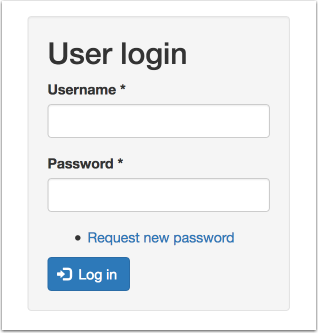
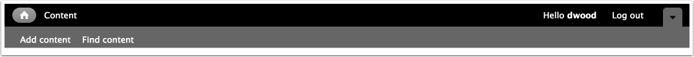
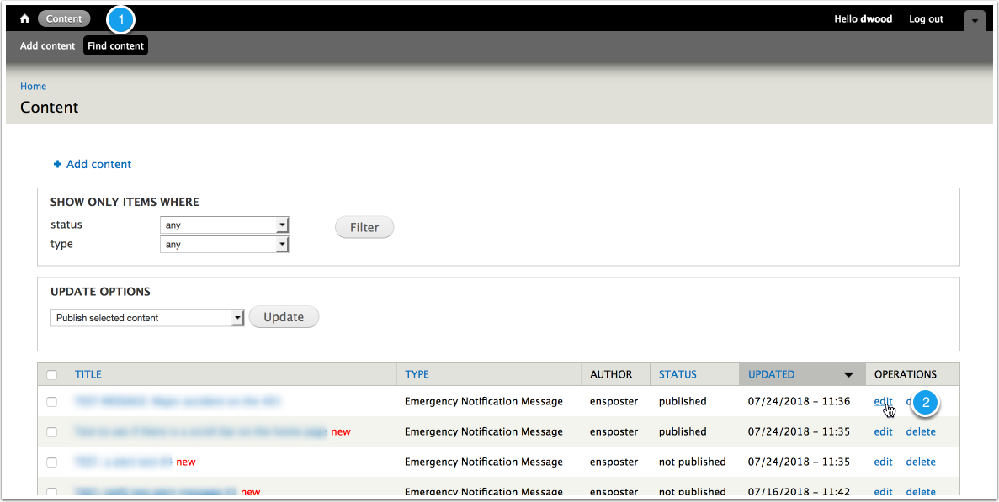
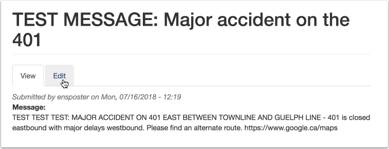
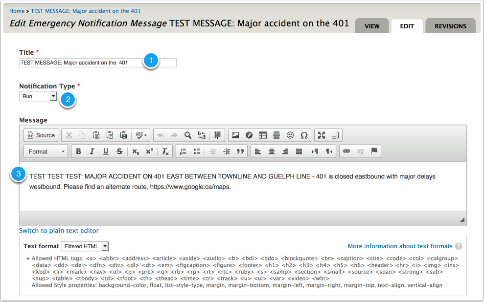
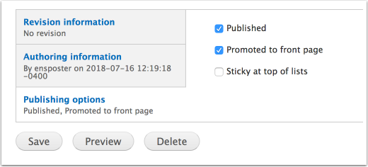
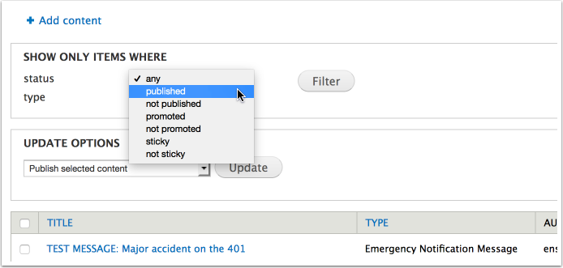
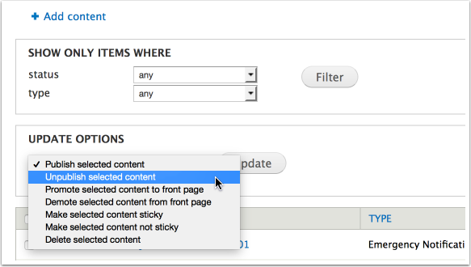

# Drupal ENS Website: Getting Started

This guide will cover:

* [How to Login/Logout](ens_getting_started.md#how-to-log-inlog-out)
* [Introduction to the Admin Menu Bar](ens_getting_started.md#introduction-to-the-admin-menu-bar)
* [Creating Basic Content](ens_getting_started.md#creating-content)
* [Editing Pre-existing Content](ens_getting_started.md#editing-pre-existing-content)

## How to Log in/Log out
### Logging In
1. Navigate to the ENS Drupal website: https://live-ug-ens.pantheonsite.io/. If you are not already logged in then you will see a login block on the left-hand side of the page.

    

2. Enter your Central Login ID in the "Username" field.
3. Enter your Central Login Password in the "Password" field.
4. Select `Log in`.

### Logging Out

There are many ways in which a user can log out. The simplest way is to click the `Log out` option located on the menu bar.

## Introduction to the Admin Menu Bar
When logged in the first bar at the top of the page is called the **Administration Menu Bar** and it allows users with the correct permissions to add/view/delete/edit content as well as other administration-specific tasks.

On the Admin Bar, the important features to note are:

* **House Icon**: When selected, the user will be brought to the home page.
* **Content**: When selected, the user will be brought to a table in which all content types are listed and availiable for selection.

## Creating Content

While it is possible to create new ENS messages manually, creating new content is not covered in this help file. Typically ENS messages will be created automatically from the Everbridge ENS system through an automatic web posting.

If you wish to learn more about creating content in the UofG Drupal environment then please see [Creating Basic Content](../basicbeginner.md#creating-basic-content) in the UG Drupal Help file.

## Editing Pre-existing Content

### How to open edit page: option 1

All ENS content can be viewed by selecting the `Find Content` (1) shortcut located in the Administration Menu shortcut bar, or by selecting `Content` in the Administration Bar itself.

Once selected, you will be brought to a page with the content listed in a table.

Clicking the edit button (2) will open the edit content window.

### How to open edit page: option 2

Another way to open the edit window is to browse to published content. If you are logged in you will see an `Edit` tab on each ENS message page.

### Edit page

Once the edit page is open, there will be two fields available to edit (1) `Title`, (2) `Notification Type`, and (2) `Message`.

The `Title` field is plain text while the `Message` field has a WYSIWYG editor that will help the editor modify the message.

If you wish to learn more about the WYSIWYG editor in the UofG Drupal environment then please see [Drupal Text (WYSIWYG) Editor](../wysiwyg-editor.md
) in the UG Drupal Help file.

The `Notification Type` is a drop down optional field which can be changed to represent the type of notification. Selection instruct the display to show a different warning image on the homepage when a notification is published. Below are the options and corresponding icon:

| Notification Type | Icon             |
| :---------------- | :--------------: |
| Alert             |  |
| Biohazard         |  |
| Fire              |  |
| Tornado           |  |
| Weather           |  |

### Saving and Publishing/Unpublishing

Once you are done editing you can then save your content and set the 'Publish' configuration. Scroll to the bottom of the page to see the `Save` button and `Publish options`

Set whether or not the page is `Published` using the check-box. You can ignore `Promote to front page` and `Sticky at top of list`. These options are not used for this site.

Click `Save` to apply your changes.

## Filter and Update Options

Returning to the `Find Content` content overview table. There are two more features that can assist when working with content.

### Filter

Drupal provides a filter to help find content by either status or type or both. The most useful for ENS will be finding published or unpublished content. You can search for specific content through the "SHOW ONLY ITEMS WHERE" filter options by selecting either `published` or `not published` from the status drop-down menu and clicking the `Filter` button

### Update Options

Similarily it is possible to change the status of multiple pages at once using the `Update Options` drop down menu.

In the content listing table, place a check next to all the content you wish to change and then select the update option. Next click the `Update` button. This is one way to unpublish multiple ENS posts at once.
