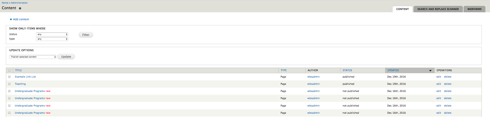

# Drupal ENS Website: Getting Started

This guide will cover:

* [How to Login/Logout](basicbeginner.md#how-to-log-inlog-out)
* [Introduction to the Admin Menu Bar](basicbeginner.md#introduction-to-the-admin-menu-bar)
* [Creating Basic Content](basicbeginner.md#creating-basic-content)
* [Editing Pre-existing Content](basicbeginner.md#editing-pre-existing-content)
* [WYSIWYG Editor](wysiwyg-editor.md)

## How to Log in/Log out
### Logging In
1. Navigate to the ENS Drupal website: https://live-ug-ens.pantheonsite.io/. If you are not already logged in then you will see a login block on the left-hand side of the page.

    

2. Enter your Central Login ID in the "Username" field.
3. Enter your Central Login Password in the "Password" field.
4. Select `Log in`.

### Logging Out
There are many ways in which a user can log out. The simplest way is to click the `Log out` option located on the menu bar.

## Introduction to the Admin Menu Bar
When logged in the first bar at the top of the page is called the **Administration Menu Bar** and it allows users with the correct permissions to add/view/delete/edit content as well as other administration-specific tasks.

On the Admin Bar, the important features to note are:

* **House Icon**: When selected, the user will be brought to the home page.
* **Content**: When selected, the user will be brought to a table in which all content types are listed and availiable for selection.

## Creating Content

While it is possible to create new ENS messages manually, how to create content is not covered in this help file. ENS messages are creaed automatically from the Everbridge ENS web posting.

If you wish to learn more about creating content in the Drupal environment then please consult 'Creating Basic Content' in the UG Drupal Help file. Otherwise have a look at Editing Pre-existing Content below.

## Editing Pre-existing Content
All content created on your website can be viewed by selecting the `Find Content` shortcut located in the Administration Menu shortcut bar, or by selecting `Content` in the Administration Bar itself.

Once selected, you will be brought to a page with the content listed in a table.

You can search for specific content through the "SHOW ONLY ITEMS WHERE" filter options.
Use the drop-down menus to filter by content status and type to find what you're looking for. 

## WYSIWYG Editor