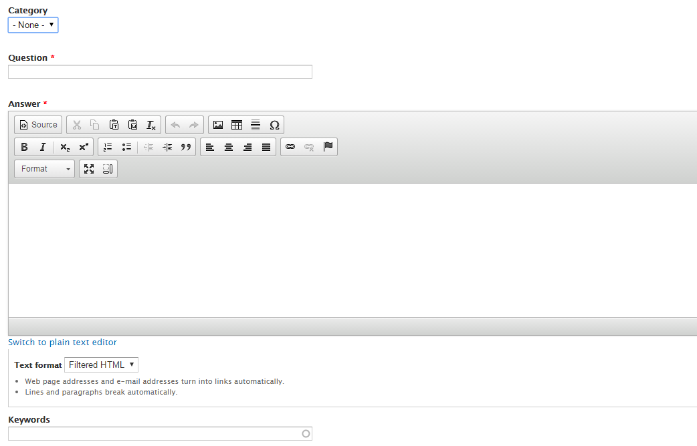

# Using FAQs
The *Frequently Asked Questions (FAQ)* feature allows **content editors** to create a repository of commonly asked questions and their corresponding answers. 

The FAQ page is automatically generated from the FAQ nodes configured and the layout of this page can be modified on the settings page. The generated FAQ page is always found at www.uoguelph.ca/sitename/faq.

* [Creating FAQ Nodes](#creating-faq-nodes-questions-and-answers)
* [FAQ Categories](#faq-categories)
* [FAQ Tags](#faq-tags)

## Creating FAQ Nodes (Questions and Answers)
1. On the Administration bar, navigate to `Add Content` > `FAQ`.
2. If you have [FAQ categories](../taxonomies.md#categories) defined, select the appropriate one. See more information on categories below.
4. Enter the Question in the "Question" field.
5. Enter the Answer in the "Answer" field.

6. Enter any tags or keywords that help categorize and organize your FAQ page.
7. Select `Save`.
   
## FAQ Categories

Your website may have a variety of FAQs that are directed at different groups of people. When this is the case, you can use categories to organize FAQs. One FAQ can only be associated with **one** category. 

###Creating FAQ Categories
1. When logged into your website, navigate to `Structure` > `Taxonomy`.
2. Select `list terms` from the `FAQ category` row.
3. Select `Add term`.
4. Enter a name for the FAQ category. Keep in mind that these names will be visible to your site users. Examples include "Students FAQ" and "Faculty FAQ." 
5. Select `Save`.
6. When you navigate to your FAQ page at www.uoguelph.ca/sitename/faq, you will see a sidebar list called "FAQ Topics" that has been generated for you.

###Assigning Categories to FAQ Nodes
1. Now that you have created an FAQ category, you need to assign questions to it. 
2. From your FAQ page, select a question. You will be brought to that question's page.
3. Select `Edit`.
4. Using the "Category" drop-down menu, select the appropriate category. 
5. Select `Save`.

## FAQ Keywords

Your website may have some questions that apply to two or more groups of site users. In this case, you must use *keywords* instead of categories to organize FAQs.

Additionally, tags can be used across Drupal content types, not just FAQs. This means you can tag a variety of news articles, events, FAQs, features, and more, as they pertain to a particular group. 

###Creating Keywords
1. When logged into your website, navigate to `Structure` > `Taxonomy`.
2. Select `list terms` from the `Tags` row.
3. Select `Add term`.
4. Enter a name for the tag. Keep in mind that these names will be visible to your site users. Examples include "Undergraduate Students" and "Graduate Students."
5. Select `Save`.

###Associating Keywords with FAQ Nodes
1. Now that you have created a tag, you need to associate questions with it. 
2. From your FAQ page, select a question. You will be brought to that question's page.
3. Select `Edit`.
4. In the "Keywords" field, type in the name of the tag. You can add multiple tags if needed, separated by a comma and a space.

 
 
5. Select `Save`.
6. When you return to the question page you were editing, you should see a listing of its associated keywords (tags) in the sidebar.

 
