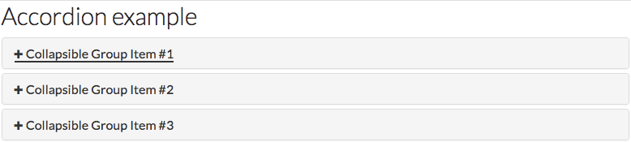
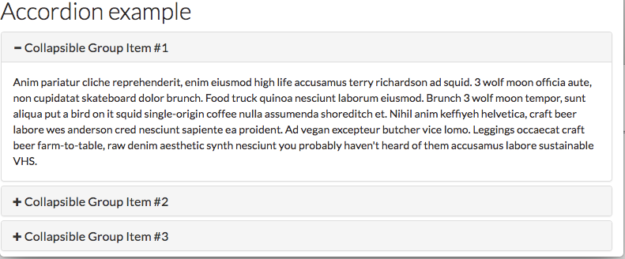

# Accordion HOWTO

Collapsible sections or "accordions" are another way to organize long documents or pages, while taking up
less screen space. Readers can flip between the sections of your document by clicking or tapping to 
expand one section of the document at a time.





To create collapsible sections in your content:
1. Click the *Source* button on the editor toolbar to switch the editor to source editing mode


2. Copy and paste the following markup into the source editor


3. Adjust the number and description of the sections to suit your content

## Markup
```
<div class="panel-group" id="accordion" role="tablist" aria-multiselectable="true">
  <div class="panel panel-default">
    <div class="panel-heading" role="tab" id="headingOne">
      <h4 class="panel-title">
        <a role="button" data-toggle="collapse" data-parent="#accordion" href="#collapseOne" aria-expanded="true" aria-controls="collapseOne">
          Collapsible Group Item #1
        </a>
      </h4>
    </div>
    <div id="collapseOne" class="panel-collapse collapse in" role="tabpanel" aria-labelledby="headingOne">
      <div class="panel-body">
        ...
      </div>
    </div>
  </div>
  <div class="panel panel-default">
    <div class="panel-heading" role="tab" id="headingTwo">
      <h4 class="panel-title">
        <a class="collapsed" role="button" data-toggle="collapse" data-parent="#accordion" href="#collapseTwo" aria-expanded="false" aria-controls="collapseTwo">
          Collapsible Group Item #2
        </a>
      </h4>
    </div>
    <div id="collapseTwo" class="panel-collapse collapse" role="tabpanel" aria-labelledby="headingTwo">
      <div class="panel-body">
        ...
      </div>
    </div>
  </div>
  <div class="panel panel-default">
    <div class="panel-heading" role="tab" id="headingThree">
      <h4 class="panel-title">
        <a class="collapsed" role="button" data-toggle="collapse" data-parent="#accordion" href="#collapseThree" aria-expanded="false" aria-controls="collapseThree">
          Collapsible Group Item #3
        </a>
      </h4>
    </div>
    <div id="collapseThree" class="panel-collapse collapse" role="tabpanel" aria-labelledby="headingThree">
      <div class="panel-body">
        ...
      </div>
    </div>
  </div>
</div>
```
