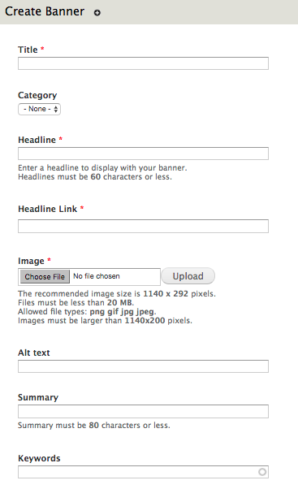
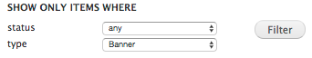
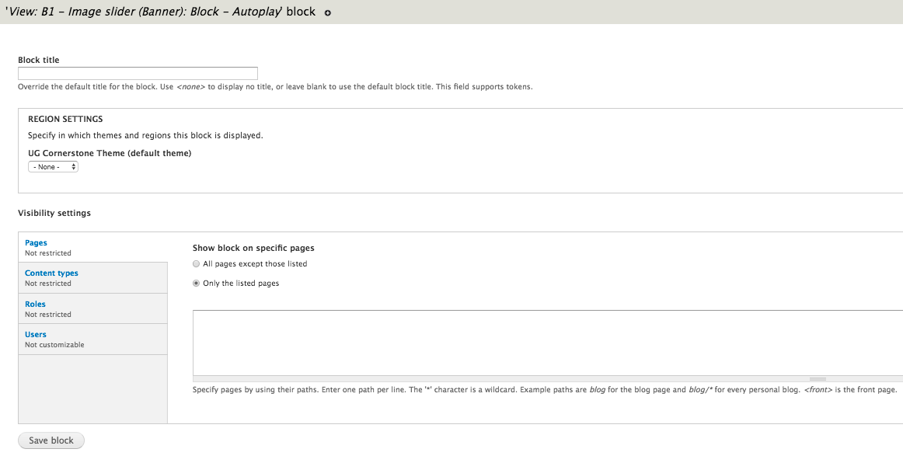

# UG Drupal Content Type: Banner

* [Creating a Banner Image]()
* [Editing a Banner Image]()
* [Removing a Banner Image]()
* [Displaying a Banner]()
* [Filtering Banner Images by Category on Specific Pages]()

**Content Creators** can create a site Banner with captions and a link. There can be multiple static banners that change every time the page is refreshed or they can be displayed as a slide show. For properly displayed banner image it is recomended the dimensions be **1140 x 292**.

## Creating a Banner Image

1. On the Administration bar, select "Add Content".
 
2. Select "Banner".
3. Once selected, the folowing page will appear.
 
3. Enter the required information:
    1. **Title**:
    2. **Category**:
    3. **Headline:** The main text attached to the image of the banner.
    4. **Headline Link:** Used to hyperlink the headline text. The headline link can link to anu URL. If the link is internal, please use a relative path.
    5. **Image**: Choose the image that you would like to upload as the banner. Then select "Upload".
    6. **Alt Text**: You must enter Alt text describing the image.
    7. **Summary (Optional)**: Appears below the headline of the banner image.
    8. **Keywords (Optional)**: Like tags, are a filtering mechanism.
6. Select the Order in which you would like this banner image (random order by default, 0 = first, 1 = second).
7. Once the above steps are completed, select `Save`.

## Editing a Banner Image
1. On the Administration bar, select "Find Content".
2. Filter the content by "Banner" using the "type" dropdown menu.
 
3. On the desired banner, select "edit".
4. Make the changes required.
5. Once the above steps are completed, select "Save".

## Removing a Banner Image

1. On the Administration bar, select "Find Content".
2. Filter the content by "Banner" using the "type" dropdown menu.
 
3. On the desired banner, select "delete". **!IMPORTANT!**: Ensure that you are removing the correct banner image.

## Displaying a Banner

**/!\ Note**: Only Web Managers / Site Owners can configure & display banners.

1. On the Administration bar, select "Structure".
2. Select "Blocks".
3. Locate the "View: B1 - Image slider (Banner): Block - Autoplay" display.
4. Select "configure"
5. After selecting "configure", the banner block configure page will open.
 
4. Select "Top Bar" in the drop-down menu under "Region Settings".
5. Under "Show block on specific pages" in the "Visibility Settings" section, you can choose the following display options:
    * **all pages except those listed**: The block will be displayed on all pages of the website **EXCEPT** for those listed in the field below.
    * **only the listed pages"**: The block will **ONLY** be displayed on the pages of the website listed in the field below.
6. Once the above steps are complete, select "Save Block".

### To Display The Banner On The Front/Home Page

1. On the Administration bar, select "Structure".
2. Select "Blocks".
3. Locate the "View: B1 - Image slider (Banner): Block - Autoplay" display.
4. Select "configure"
5. After selecting "configure", the banner block configure page will open.
 
4. Select "Top Bar" in the drop-down menu under "Region Settings".
5. Under "Show block on specific pages" select "only the listed pages".
6. In the text field below, enter "`<front>`".
7. Once the above steps are complete, select "Save Block".

## Filtering Banner Images by Category on Specific Pages
By following the steps below, you can create a banner slideshow that is (a) filtered by a specific category and will (b) only show on specific pages.

1. Creating a Banner Category
    1. On the Administration bar, select "Structure".
    2. Select "Taxonomy".
    3. Locate "Banner Category" and select "add terms".
    4. Add a term to identify each unique slideshow (eg. Front Page).
    5. Enter a description if needed. (Optional)
    6. Select "Save".
    7. After selecting save, take note of the term ID associated with your new term (you can find this is the URL when you edit the term after creating one and clicking the edit button ). Write it down or remember it for later.
   
   8. Navigate to each banner that you want to show in this slideshow and set its category to match the one you just created. For steps on how to do this follow the [Editing a Banner Image]() section. 

2. Create a Mini Panel for you new Banner Category
    1. On the Administration bar, select "Structure".
    2. Select "Mini panels".
    3. Select "+ Add".
    4. Enter a descriptive Administrative title for your unique slideshow.
    5. Enter a description if needed.
    
    6. Select "Continue". 
    7. Select "Continue" again. 
    8. Select "Continue" again.
    9. Select "Finish".

3. Place your Mini Panel
    1. On the Administration bar, select "Structure".
    2. Select "Blocks".
      3. Locate the Banner Mini panel you created in step 2. Configure the settings for the banner using the steps from [Displaying a Banner](). Ensure that you specify the pages in which you would like to add the banner to.

4. Add a Category-filtered Banner View Pane to your Mini Panel
    1. Navigate to one of the page where you have configured your banner mini-panel to show. This can be done via URL, Menu Structure or Administration Bar: Content or Find Content.
    2. Beneath the navigation bar, select "Edit 'your banner name'".
    3. Select "Customize this page". 
    4. In the Top region, select the "+" (add) symbol and select View panes / View: B1 - Image slider (Banner): Manual.
    5. Select "Save".
    6. Select "Customize this page" again.
    7 .In the Top region, you will see the view pane you just added. Select the Settings toggle icon on the far left of this view pane.
   8. Under Category, specify the term ID that you created in Banner category for this slideshow. (Reference Step 1, Sub-step 7)
   9. Under Num items, specify the number of items you wish to show in this banner slideshow.
   10. Select "Finish".
   11. Select "Save".
