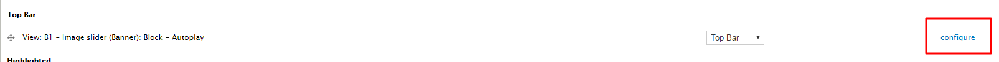

# How to Create a Banner
**Content Creators** can create a site Banner with captions and a link. There can be multiple static banners that change every time the page is refreshed or they can be displayed as a slide show. For properly displayed banner image it is recomended the dimensions be **1140 x 292**.

## To Add a Banner Image

1. Select `Add Content` at the top of the administration bar. 
2. Select `Banner`.
3. Enter the required information: *Title, Category, Headline, Headline Link*.
    * **Headline:** Appears on the image.
    * **Headline Link:** can link to any website, if internal link use the page name.
4. Image - `Upload Image:` Choose File – *Upload*.
    * You must enter Alt text describing the image.
5. Enter optional information: *Summary, Keywords*.
    * **Summary:** Appears below the headline.
    * **Keywords:** like tags, are a filtering mechanism.
6. Select the Order (random order by default, 0 = first, 1 = second).
7. Select `Save` when done.

*Note: To add more banner images do the same steps as listed and change the order if you have a preferred order.*

## To Display The Banner On The Front Page
*Note: Only SiteManagers can activate the banner module*

1. Select `Structure` at the top of the administration bar.
2. Select `Blocks`.
3. Two options:
    * If you want a **static banner** drag *View: B1 - Image slider (Banner): Block - Manual* up to the *Top Bar* block region or select highlighted from the dropdown menu (*RECOMMENDED*).
    * If you want a **slide show banner** drag *View: B1 - Image slider (Banner): Block - Autoplay* up to the *Top Bar* block region or select highlighted from the dropdown menu.
4. Select `Save Blocks`.

## To Configure the Banner
*Note: Only SiteManagers can configure.*

1. Select `Structure` at the top of the administration bar.
2. Select `Blocks`.
3. Beside the **drop down menu**, select **configure**

4. Under **Show block on specific pages,** there is the option to show the banner on "all pages except those listed" or "only the listed pages"
5. If you want the banner to appear only on the *front* page, type **< front>**  in the blank space.

6. Select `Save Blocks`.

## How to Filter Banners by Category on Specific Pages
With the following steps, you can create a banner slideshow that is (a) filtered by a specific category and will (b) only show on specific pages. I've also included steps to change the number of items.

1. Creating a Banner Category
   - Under Structure / Taxonomy / Banner category, add a term to identify each unique slideshow (eg. Front Page).
   - Take note of the term ID associated with your new term (you can find this is the URL when you edit the term after creating one and clicking the edit button ). Write it down or remember it for later.
   
   - Under Find Content, navigate to each banner that you want to show in this slideshow and set its category to match the one you just created. 

2. Create a Mini Panel for you new Banner Category
   - Under Structure / Mini panels, select "Add" and type in a description Administrative title for your unique slideshow, then press Continue. 
   - For Context, press Save.
   - For Layout, press Save.
   - For Content, press Finish.
   

3. Place your Mini Panel
   - Under Structure / Blocks, find the Banner Mini panel you just created and move it into the Top Bar region (you can either move it there or use the select box to put it in the Top Bar region).
   - Press Save blocks.
   - On the same page, find your mini panel again (in the Top Bar region) and select Configure.
   - Under Pages / Show block on specific pages, select "Only the listed pages" and specify the page paths where you want your banner to show.
   - Press Save Block.
   

4. Add a Category-filtered Banner View Pane to your Mini Panel
   - Navigate to one of the pages where you have configured your banner mini-panel to show.
   - Beneath the navigation bar, press the "Edit <your banner name>" button.
   - Press Customize this page. 
   - In the Top region, press the + (add) symbol and select View panes / View: B1 - Image slider (Banner): Manual.
   - Press Save.
   - Press Customize this page again.
   - In the Top region, you will see the view pane you just added. Press the Settings toggle icon on the far left of this view pane.
   - Under Category, specify the term ID that you created in Banner category for this slideshow.
   - Under Num items, specify the number of items you wish to show in this banner slideshow.
   - Press Finish.
   - Press Save.
