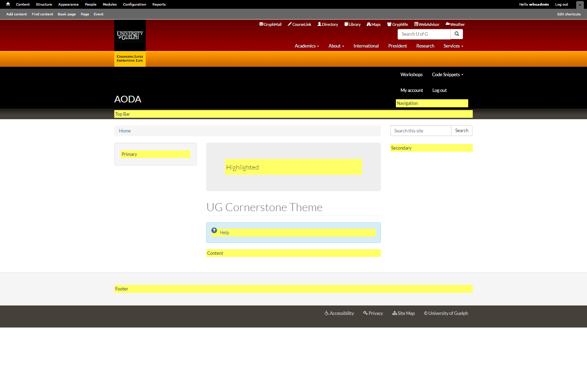
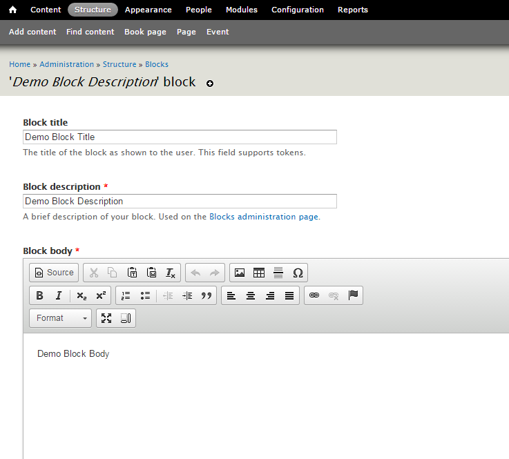
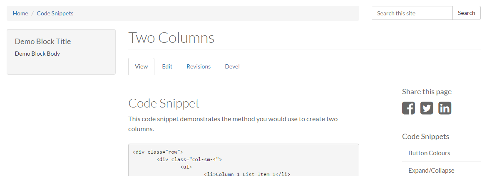

# How to Create a New Block
1. View bottom of the page and click **Customize this page**

    a. Click on **Left side**

      * Select Region Style (Paint Brush)

      * Ensure **Style** is **Bootstrap** and click **Next** button

      * Change **Column size** to **--None--**

      * Change **Offset size** to **--None--**
    
    b. Click on **Middle Column**

      * Select Region Style (Paint Brush)

      * Ensure **Style** is **Bootstrap** and click **Next** button

      * Change **Column size** to **12**

      * Change **Offset size** to **--None--**
        
    c.Click on **Right side**

      * Select Region Style (Paint Brush)

      * Ensure **Style** is **Bootstrap** and click **Next** button

      * Change **Column size** to **--None--**

      * Change **Offset size** to **--None--**

2. In the top menu, click **Structure**

    a. To view block regions:

      * Click **Demonstrate block regions (UG Cornerstone Theme)** at the top

      * You will see a screen similar to the one below appear. Each block region will be listed and highlighted in yellow
        

    b. To add blocks:
    
      * You can scroll down to the **Disabled** Blocks region and add a block of your choice to your region of preference
    
      * To create a new block click on **Add block**
    
      * Fill out the fields

        ## Initial Block Settings
       * **Block title:** Enter a title for your block. If you enable the option to show a title for your block, this is what will show.
      
       * **Block Description:** Used to help identify this particular block. If you had several blocks for example, unique descriptions will help you organize and manage your blocks.
       **Block body: ** What you’re showing

        ## Region Settings  
       * Setup where your block will appear

        ## Visibility Settings
       * **Pages:** allows you to restrict which pages this block will be displayed in      
       * **Content types:** allows you to control which content types this block will appear with

    c. Click **Save block** at the bottom of the page

    d. If you wish to configure the blocks, you may do so after saving the blocks
        * Configuring a block allows you to edit the contents of the block, and deal with the visibility settings
      
    **2.1 Creating your Block**
    
    
    **2.2 How it will appear on your site (Placed in Primary Region)**
    
