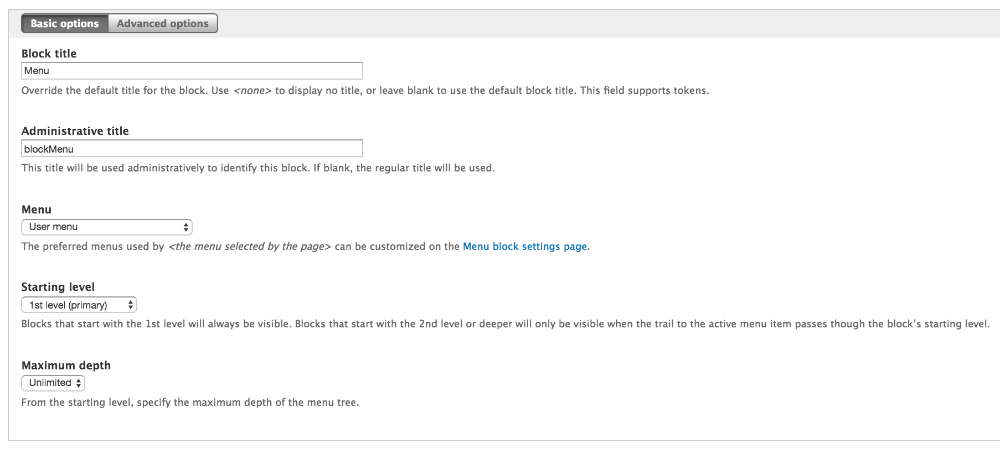
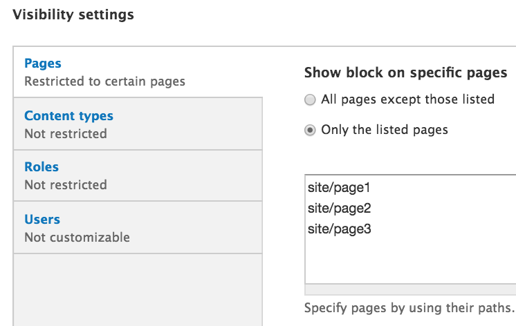
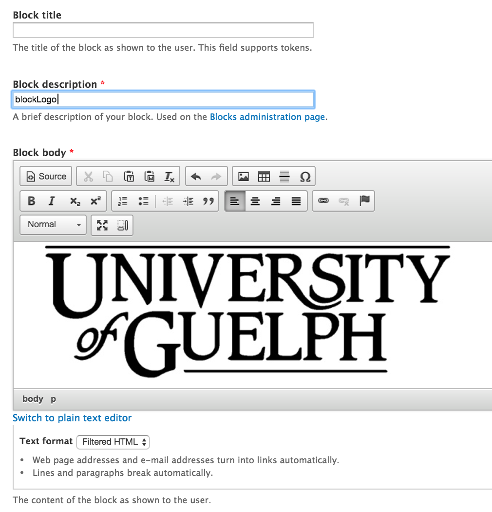

# How to Create a New Block
1. View bottom of the page and click **Customize this page**

    * Click on **Left side**

        * Select Region Style (Paint Brush)

        * Ensure **Style** is **Bootstrap** and click **Next** button

        * Change **Column size** to **--None--**

        * Change **Offset size** to **--None--**

    * Click on **Middle Column**
        * Select Region Style (Paint Brush)

        * Ensure **Style** is **Bootstrap** and click **Next** button

        * Change **Column size** to **12**

        * Change **Offset size** to **--None--**
        
    * Click on **Right side**

        * Select Region Style (Paint Brush)

        * Ensure **Style** is **Bootstrap** and click **Next** button

        * Change **Column size** to **--None--**

        * Change **Offset size** to **--None--**

2. In the top menu, click **Structure**

    * To view block regions:

        * Click **Demonstrate block regions (UG Cornerstone Theme)** at the top

        * You will see a screen similar to the one below appear. Each block region will be listed and highlighted in yellow
        

    * To add blocks:
    
        * You can scroll down to the **Disabled** Blocks region and add a block of your choice to your region of preference
    
        * To create a new block click on **Add block**
    
        * Fill out the fields

        ## Initial Block Settings
       * **Block title:** Enter a title for your block. If you enable the option to show a title for your block, this is what will show.
      
       * **Block Description:** Used to help identify this particular block. If you had several blocks for example, unique descriptions will help you organize and manage your blocks.
       **Block body: ** What you’re showing

        ## Region Settings  
       * Setup where your block will appear

        ## Visibility Settings
       * **Pages:** allows you to restrict which pages this block will be displayed in      
       * **Content types:** allows you to control which content types this block will appear with

    * Click **Save block** at the bottom of the page

    * If you wish to configure the blocks, you may do so after saving the blocks
        * Configuring a block allows you to edit the contents of the block, and deal with the visibility settings
      
**2.1 Creating your Block**

    
**2.2 How it will appear on your site (Placed in Primary Region)**

## Common Usage for Blocks
1. Display Menu on Specific Pages
   - When creating a new block, select Add Menu Block instead of Add Block.
   
   - Fill out the Block Title and Administrative Title.
   - Select the menu you would like to display. (Based off the assumption the menu you would like to display already exists)
   - Select starting level.
   - At the bottom, select what pages you would like the menu to display on.
   
2. Display Image/Logo on Specific Pages
Follow the above steps with these steps in mind.

   - Leave the title of the block empty.
   - Put the image, with appropriate alt text, in the block using the Drupal Text Editor.
   - At the bottom, select what pages you would like the menu to display on.
   
