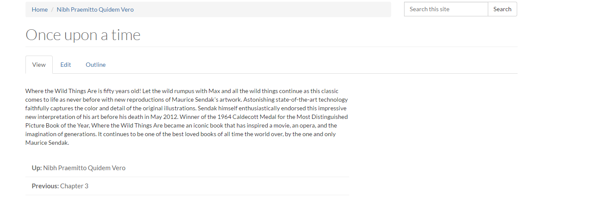
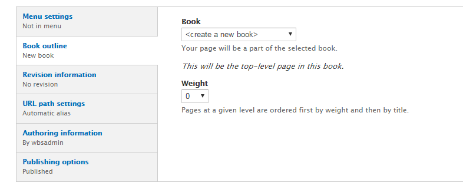
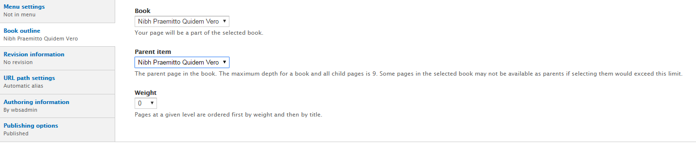

# How to Add Book Page

The Book Feature permits **content creators** to organize content into ordered sections, similar to the chapters and pages of physical books.

Books have a built-in hierarchical navigation, which means that they can be organized to be read in a particular order. Each book page contains a link to its parent page, as well as to the previous and next pages in the order specified.

## To Add a Book page

1. On the Administration bar, select `Add Content`
 *    
2. Select `Book page`
3. Enter a **Title**.
4. If you have [book page categories](../taxonomies.md#categories) defined select the appropriate one.
5. In the **body field** enter what you want displayed on your book page. Follow this link [for more information on how to use the WYSIWYG editor](../wysiwyg-editor.md).

6. If you want to add any files to download attach them using the **File Attachment** option.

7. Enter any *tags or keywords* that help categorize and organize your book page.
8. If you want this web page to be accessed through your menus check the `provide a menu link`.
    1. Enter an appropriate **Title** and **Description**.
    2. In the `Parent item` drop down menu, select which menu heading you want the new link to be accessed through. *Example: If it is an event select event to have it as a sublink there.*

9. Under `Book outline`, select the preferred option of where you want the page to be visible.  

10.  If you have the proper authority to publish right away, select `Published` in `Publishing options`. You can choose **Create a new book** or pick from previously created books.
      1. If adding a book page to a specific book, it is important to add a **Parent item** in the book and select the appropriate `weight`

11. Select `Save` when you are done.
 * 
