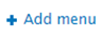
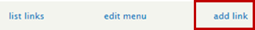
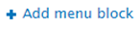

# Categorizing and Displaying Profiles

Some departments choose to display their staff profiles by the team they (belong) to, doing this with our Drupal platform will give you the following view. These instructions will guide you through the process of categorizing the profiles on your site by the teams they work in.

## Adding Profile Categories (e.g web & development solutions)
1.	Add profile category terms using the steps in [How to Add Vocabulary Terms](/howto-profiles.md)
2.	Click edit beside each term you added and get the term Id from the URL (/taxonomy/term/`#`/) 

## Adding the Terms to a Custom Menu Block on the Right Side of the Page
3.	Using the administration bar, navigate to structure > menus
4.	Select add menu 
5.	Enter a menu title e.g. Faculty and Staff Directory
6.	Click, save
7.	Select Add link  and do the following for each taxonomy term you created in step 1(Link to add vocabulary terms)
    * Enter a "title" e.g. a section name (Deans office)
    * Enter the term Id you copied from **step 2** in the following format `people/#` into the “path” field. Where `#` is the Id number

## Adding the People page
8.	Navigate back to menus  and click on "add link" on the right of the Main menu option
9.	Enter a menu link title e.g. Staff & Faculty
10.	Enter "**people**" into the “path” field

## Adding the Custom Menu as A block on profiles page
11.	Navigate to structure > blocks
12.	Select Add menu block 
13.	Enter a title you would like as the “Block title” and “administrative title” e.g. Faculty and Staff Directory
14.	Select the menu title you created under the “menu” drop down
15.	Select “starting level” as 1st level (Primary)
16.	Within the region setting select secondary in the drop down
17.	Select “Only the listed pages” radio button
18.	In the text area enter the following paths
    * people
    * people/*
