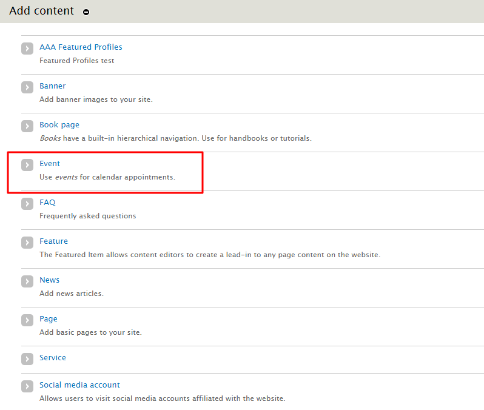

# How to Create an Event
The Events feature allows **Authors** to add events to the website and display them in a Listing Page view, a Weekly Events view, a Monthly Calendar view, an Event Detail Page view, and an Upcoming Events Teaser List view. Any event can be highlighted (or “featured”) on any page using the Featured Items block. Site visitors can also browse for events by date and event category.

## To Create an Event

1. Select `Add Content` at the top of the administration bar.

2. Select `Event` in the list.

3. Enter a **Title**. *(Mandatory)*
4. Enter the starting and ending **Dates and Time**. *(Mandatory)*

5. Enter a **Location**.

6. In the **Body field** enter the details and summary of the information.

7. [Select your Section](../taxonomies.md#Sections) if you have defined one.
  * For sections a **Taxonomy** for `Event_headings` needs to be created. The `Sections` datafield is where content creators can add data that doesn't conform to the already predetermined Events feature such as *Cost*, or *Extra Directions*, or  *Dinner Menu Items*. A Section does not need to be added and can be left blank.
8. Add a `feature image` if there is one for the event, such as a poster image.  Add a descriptive **Alt Text** - a **Caption** is optional. *Note: Any information available on the image should also be available in your summary.*

9. Add any files relevant to the Event and enter a related website for your event *(if there is a page dedicated to the event)* with a descriptive title.

10. Select the Save button when you are done.

