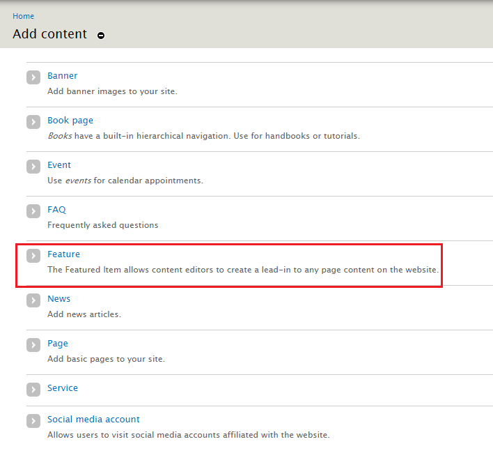

# How to Create a Featured Item
The *Featured Item* allows **Content Creators** to create a lead-in to any page content on the website (e.g. Events, News, Basic Page, People Profiles, etc.) or an external URL. Featured Items are usually set to be displayed on the front page.

## To Create a Featured Item
1. Select `Add Content` at the top of the administration bar.

2. Select `Feature` in the list.

3. Enter a **Title**.
4. If you have [page categories](../taxonomies.md#categories) defined select the appropriate one.
5. Upload your Featured items **Image** by selecting `choose file`.
    * Add a descriptive **Alternative tag**.
    * Featured images should be `dimensions here` and should pertain to the subject matter.
6. Enter the direct link to the featured item - such as an Event or News Article page - in the Link field.

7. Enter a short **Summary**
8. Enter a few **Keywords** to help tag the feature item.

9. If you have the proper authority to publish right away, select `Published` in `Publishing options`

10. Select Save when you are done.

