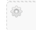

# Mini Panels

[Creating a mini panel](#Creating-a-mini-panel)
[Configure Mini Panels to appear on a page or homepage](#Configure-Mini-Panels-to-appear-on-a-page-or-homepage)
[Activating Mini Panels under blocks](#Activating-Mini-Panels-under-blocks)

Mini panels are portable panels with 2 or 3 columns that display many types of content (custom content, view panes, menus, etc.) 
Once a mini panel is built it can then be placed as a block in any region of your site.

## Creating a mini panel
1.	Click on `Structure` in the Administration menu bar and select `Mini panels` 
2.	Click `+` Add

3.	Under Administrative title, enter a unique name for your mini panel. Click `Continue`.
4.	Click `Continue` again (to skip the Context menu) and then select **Two Columns Stacked** and click `Continue`.
5.	Select **Two Columns Stacked** or **Three Columns Stacked** depending on how many columns you need. Click `Continue`.
6.	You can enter a title if you like, unless select the **No title** option under **Title type**.
7.	Click on the gear  button for the section you would like to add content to and select `Add content`
8.	Select **New custom content**
9.	The WYSIWYG editor will open. Add a **title** and add content to the **body** section
10.	Click `Finish`
11.	Repeat steps 9 – 12 for all other sections you would like to add content to
12.	Once sections have been filled, click on the gear  on each section and do the following:
    * Select `Change` under **Style**. In the menu that pops up, select **Bootstrap**. Select `Next`.
    *	Change Column Type to Small & medium devices. Change Column sizes (*They must add up to 12*). Set Offset size to none. Click `Save`.
13.	Click `Save`.

**/!\ Note**: Please note that this mini panel will not appear anywhere on your site until it’s activated under Blocks or added to a page.

## Configure Mini Panels to appear on a page or homepage
1.	Click the `Home button` in the Administration menu bar.
2.	Once on the home page, click `Customize this page` (found at bottom of your screen).
3.	Under the **Top** or **Bottom** section, click `+` and select `Mini panel`.
4.	Under Mini panel, select the title of the mini panel you created. Click `Finish`.
5.	Click `Save` at the bottom of the screen.

**/!\ Note**: Please note that if you use this method to add mini panels to a page it will show up on all your pages. 
If you add it the homepage it will show up on only the homepage.

## Activating Mini Panels under blocks
1.	Click on `Structure` in the Administration menu bar and select `Blocks`.
2.	Scroll down under the Disabled section of the list and look for your mini panel title it should be in the format: **Mini panel:
“Mini panel name”**.
3.	Click `configure`.
4.	In the `Region Settings` section select **Content** from the drop-down list.
5.	At the bottom of the page select the radio button option for **only the listed pages**
6.	Enter the node number(s) of the page you would like the mini panel to appear on. With the format: node/number 
(*node number can be found in the URL of the edit page section*)

7.	Click `Save block`.
