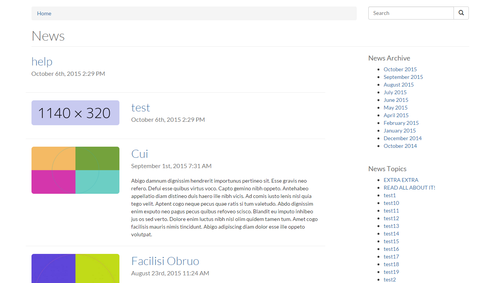
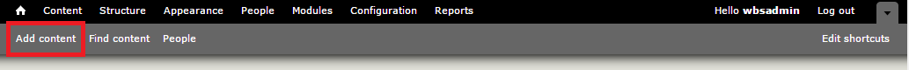
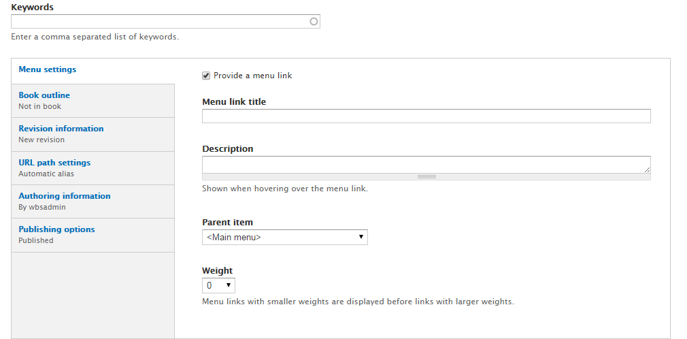
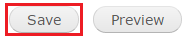

# How to Create a News Item
The *News* feature allows content authors to add news articles to the website and display them in a Listing Page view, an Article Detail Page view, and a Recent News Teaser List view. Any article can be featured on any page using the Featured News Article view. Site visitors can also browse for news articles by date and category tag.

---

## To Add a News Article
1. On the Administration bar, select `Add Content`.
    * 
2. Select `News`.
    * 
3. Enter a **Title**
4. If you have [page categories](taxonomies.md#categories) defined, select the appropriate one.
5. Enter a **Written by**.
6. In the body field, enter what you want displayed on your web page. [Here is more information on how to use the WYSIWYG editor.](wysiwyg-editor.md)
    * 
7. Add a feature image if there is one for the news, such as an image of the subject matter. It is required to add **Alternative Text** if the image is not a decorative one. Add a **Caption**.
    * 
8. Enter any *tags or keywords* that help categorize and organize your article.
9. If you want this web page to be accessed through your menus check the `provide a menu link`.
    1. Enter an appropriate **Title** and **Description**.
    2. In the `Parent item` drop down menu select which menu heading you want the new link to be accessed through. *Example: If it is an event select event to have it as a sub-link there.*
    * 
10. If you have the proper authority to publish right away, select `Published` in `Publishing options`.
11. Ensure `Promoted to front page` is selected.
11. Select Save when you are done.

