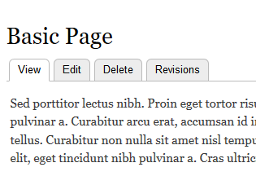
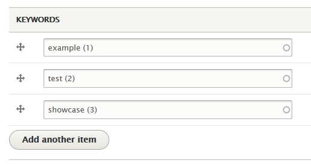

# UG Drupal Content Type: Page

* [Creating a Page](howto-page.md#creating-a-page)
* [Editing a Page](howto-page.md#editing-a-page)
* [Deleting a Page](howto-page.md#deleting-a-page)
* [Attaching a File to a Page](howto-page.md#attaching-a-file-to-a-page)
* [Assigning a Category to a Page](howto-page.md#assigning-a-category-to-a-page)
* [Page Keywords](howto-page.md#page-keywords)

The **Page** content type is used for static content that can (but are not required to) be linked into the main navigation bar. This is one of the most "basic" content types and can be very flexible.

## Creating a Page
1. On the Administration bar, select "Add Content".
 
2. Select "Page".
 
3. Enter the title of the page in the "Title" field.
4. If you have [page categories](../taxonomies.md) defined, select the appropriate one. For more please see the [Assigning a Category to a Page](howto-page.md#assigning-a-category-to-a-page) section.
5. Use the [Drupal Text (WYSIWYG) Editor](../wysiwyg-editor.md) to fill the page with your desired content.
6. If you want to add any files (PDF, Docs, Images) to be attached to the page and availiable for download by the user, you can do so by attaching them using the "File Attachment" option. For more please see the [Attaching a File to a Page](howto-page.md#attaching-a-file-to-a-page) section.
7. If you want this web page to be accessed through your website menus visit the [Managing Menues](../menuitems.html#adding-content-to-a-menu) section.
8. If you have the [proper authority](../rolesandresp.md) to publish right away, ensure that the "Published" checkbox is checked under "Publishing options".
9. Once the above steps are completed, select "Save".

## Editing a Page

**/!\ Note**: Only one user can edit a page at a time. If multiple users are editing a page then content may be unsaved or lost.

1. Navigate to the page in which you would like to edit. This can be done via URL, Menu Structure or Administration Bar: Content or Find Content.
2. Once you are at the page you would like to edit, select the "Edit" option.
 
3. Edit the content you would like to edit on the page by using the Drupal Text (WYSIWYG) Editor.
4. Once you have completed the above steps, select "Save".

### Reverting a Page
If you would like to go back to a previous version of the page, follow the below steps:

1. Navigate to the page in which you would like to edit. This can be done via URL, Menu Structure or Administration Bar: Content or Find Content.
2. Once you are at the page you would like to edit, select the "Revisions" option.
 
3. You will be brought to a page which has the previous revisions of the page. Every time a page is saved a new revision version is created.
 
4. You can compare revisions by selecting what versions you would like to compare by the circle select options. Then select the "Compare" button.

## Deleting a Page

**/!\ Note**: If the page is a parent item in a menu for other pages, the page will be deleted but not removed from the menu structure. Therefore, if selected, the user will encounter a [404 Error](../basicbeginner.md#common-web-errors).

1. Select "Find Content" on the Administration Bar.
2. Find the page you would like to delete. **!IMPORTANT!**:Ensure that the page selected is the page you would like to delete.) 
3. Select "delete".

## Attaching a File to a Page

In order to attach a file to a page, the file must be **less than 20MB** and one of the following formats:
* .txt
* .pdf
* .doc
* .docx
* .rtf
* .png
* .gif
* .jpg
* .jpeg
* .zip
* .xls
* .xlsx
* .ppt
* .pptx
* .csv
* .dmg

To attach a document to the page, please follow these steps:

1. Navigate to the page in which you would like to edit. This can be done via URL, Menu Structure or Administration Bar: Content or Find Content.
2. Select "Edit".
3. Navigate to the "File Attachments" section.
 
4. Select the "Choose file" button and navigate to the file in which you would like to attach.
5. Select "Upload"
5. Once the file is uploaded, it will appear in a table under "File Attachments".
 
6. For each attachment, you have the following options:
    * **Description Field**: Provide a description for the file so the user knows what the file contains. 
    * **Display Checkbox**: If checked, the page attachment is visible to all users.
    * **Remove Button**: Once selected, the attacment is removed.

## Assigning a Category to a Page

Page categories allow for pages to be sorted via the given term /  category.

**/!\ Note**: The following steps assume that the category has already been created.

1. Navigate to the page in which you would like to edit. This can be done via URL, Menu Structure or Administration Bar: Content or Find Content.
2. Select "Edit".
3. Select the category you would like to place the page under using the dropdown menu under "Page Category".
4. Select "Save".

## Page Keywords
1. Navigate to the page in which you would like to edit. This can be done via URL, Menu Structure or Administration Bar: Content or Find Content.
2. Select "Edit".
3. Navigate to the "Keywords" section.
 
4. Enter the keywords for the page. Seperate each word by a comma. (Eg: example,test,showcase)
 
5. Select "Save".
