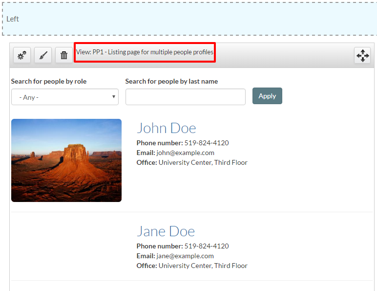
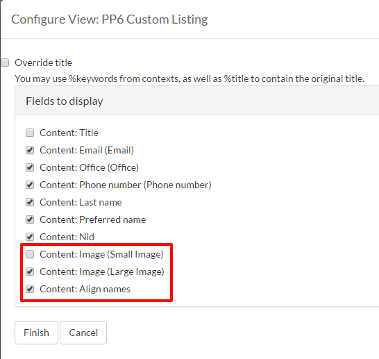

# How to Add People Profiles

The people profiles feature allows **Content Creators** to create and edit an organizational profile. Anonymous users can browse through these profiles in a listing page view and find more detail about a specific member of an organization by clicking on that member's name.

* [Using Taxonomy for People Profiles](#creating-terms-for-vocabularies)
* [How to Add People Profiles](#how-to-add-people-profiles)
* [Customizing People Profiles Layout](#customizing-people-profiles-listing-page)

## Creating Terms for Vocabularies

Before creating a profile, it is suggested that the following vocabularies are filled with terms. Otherwise, most of the people profile features will be unusable

Add terms to the following:

1. **Area of research:** If applicable, you can describe the different areas of research for your department/users. This is optional. Example: *Molecular Interactions of Dihydrogen Monoxide*.
2. **Profile category:** This is a way to filter views. Example: *create a teaser view for specific departments within a college*.
3. **Profile field labels:** This is for adding extra field headings that are not already supported by the platform. Examples: *Interests, Office Extension, Favourite Colour, etc.*
4. **Profile section labels:** Profile sections are used to separate and organize parts of the people profile. Examples: *Research, Education, Selected Publications, etc.*
5. **Profile role:** Clients can create any number of positions/roles for their needs. Examples: *Staff, Faculty, Students, Co-op, etc.*
6. **Profile unit:** This describes the title of the department or faculty an individual is a part of.
7. **Profile sub unit:** This is the sub-unit of a department. Example: *Web Business Solutions* is a sub-unit of *CCS*.

### How to Add Vocabulary Terms

1. Using the administration bar, navigate to `Structure` > `Taxonomy`.
2. You will see a long list of vocabularies. Seven of these vocabularies (listed above) are related to people profiles. Select `list terms` for the vocaubulary you would like to add terms to. 
2. From the vocabulary (list of terms) page, select `Add term`. 
3. Enter a name for the term. Enter a description if needed. 
4. Select `Save`. 

#### Taxonomy: Profile Field Labels

This vocabulary allows you to add custom fields to your people profiles. Add terms to this vocabulary to determine the field labels. For instance, if the field were to show "*Interests:*  Sports", then "Interests" would be a term in the `profile field labels` category. 

After custom fields are created through taxonomy, they can be added through the "*PROFILE FIELDS*" section that appears when creating or editing a profile. The Label dropdown menu is populated with the terms from the vocabulary above. Fields will appear in the same order as they are entered, but can be reordered by dragging. Custom fields will always appear _after_  preset fields (i.e. Email, Phone Number, Fax, Office, and Lab).

Do not confuse this vocabulary with `profile section labels` vocabulary, which is used for adding larger sections that use the Drupal text editor. 

## How to Add People Profiles

1. On the Administration bar, navigate to `Add Content` > `Profile`.
4. Begin filling out the profile, starting with adding a **Preferred name** and **Last name**.
7. Many of the fields in the profile are optional, but it is recommended to add at least a name, role, and contact information.
12. Add any related **File** or **Image Attachments**. Remember to select `Upload` after choosing your file. 
15. If the member also has a `Website Link` then include a **title** and **URL**.
16. In order to add `Profile Sections`, select a value under **Heading** and enter any **Content** needed. Keep in mind that by clicking **Add another item**, you can add as many `Profile Sections` as you like.
17. Enter any *tags or keywords* that help categorize and organize your people profiles.
17. Select `Save` when you are done.

## Customizing People Profiles Listing Page

You have the ability to change the size and alignment of the pictures on the people profile listing page, which is visible to site users. Follow these steps to customize your listing page: 

1. Navigate to www.uoguelph.ca/sitename/people, or navigate to your people profiles page via your site menu. 
2. Select `Customize this page` at the bottom of the screen.
3. You will see the PP1 view pane in the `Left` section, similar to this image:
 
 
 
4. To change either the size or alignment of the images, first, delete the PP1 viewpane by selecting the trash can button. This will *not* delete your people profiles. 
5. Under the `Left` section, select `+` (plus sign). The "Add Content" window will open. 
6. In the side menu, select `View panes`. From the list of view panes, select `View: PP6 Custom Listing`. 
7. When the "Configure new View: PP6 Custom Listing" opens, check **ONE** of `Content: Image (Small Image)` or `Content: Image (Large Image)`. 
8. Check `Content: Align names` if desired. This will ensure that on the listing page, names with no image are aligned with other names, for a neater presentation. 

 
 
9. Select `Finish`.
10. When the configuration window closes, make sure to select `Save` at the bottom of the screen. 
11. If you need to reconfigure the settings for the PP6 view pane, simply select the cog button at the top of the view pane. 

