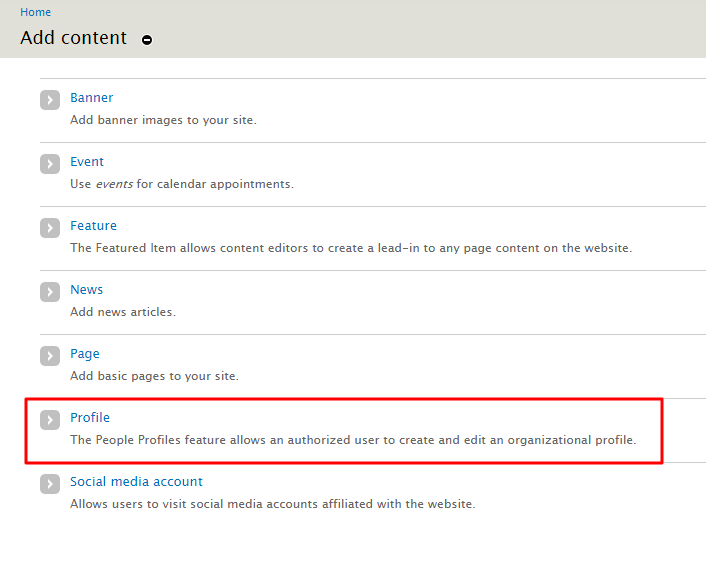
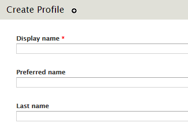
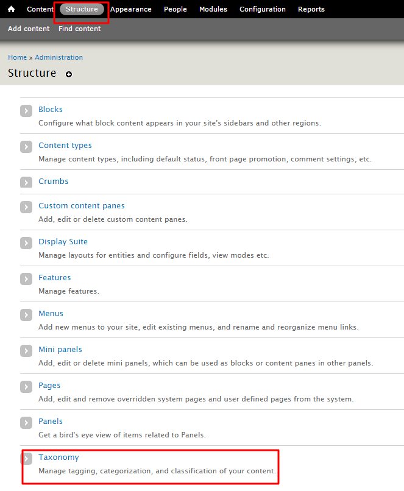
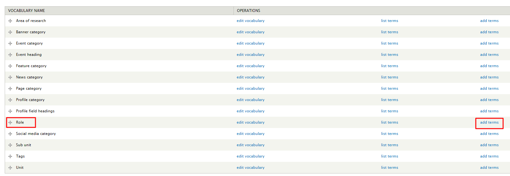
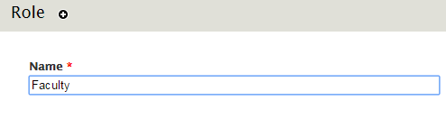
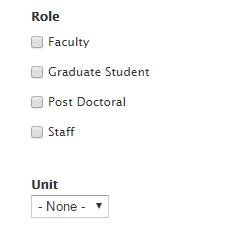
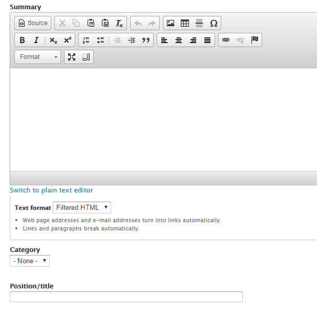

# How to Add People Profiles

The people profiles feature allows **Authors** to create and edit an organizational profile. Anonymous users can browse through these profiles in a listing page view and find more detail about a specific member of an organization by clicking on the preferred member's name.

## To Add People Profiles

1. On the Administration bar, select `Add Content`
  *    
2. Select `Profile`
  * 
3. Enter a **Display Name**
4. Add a **Preferred name** and **Last name** *(Optional)*
  * 
5. In order to select the specific `Role(s)` associated with a profile. The roles need to be created. Select `Structure` on the administration bar and click `Taxonomy`  
  * 
6. Under **Role**, select **Add Terms**
  * 
7. Add a **Name** of the role and select **Save**. You can add as many roles as you prefer.
  *    
  * 
6. To add a profile `Unit` to be associated with a profile, it needs to be created.  Select `Structure` on the administration bar and click `Taxonomy`  
  * 

7. Add a short **Summary** about the member
8. Select the `Category` from the drop-down menu *(optional)*  
9. Add a **Position/title** representing the member of the organization *(optional)*
 * 
10. Select the `Sub-unit` from the drop-down menu *(optional)*  
11. Select the `Area of Research` *(optional)*  
12. Add any related **File** or **Image Attachments**
13. Enter an **Image Caption**
  * 
14. In order to make it easier for anonymous users to contact the member, it is beneficial to add **Mailing Address**, **Email**, **Phone number**, **Fax**, **Office**, and **Lab** information. *(optional)*   
15. If the member also has a `Website Link` then include a **title** and **URL** *(optional)*  
16. In order to add `Profile Sections`, select a value under **Heading** and enter any **Content** needed. Keep in mind you can add as many `Profile Sections` as you prefer, by clicking **Add another item**
17. Enter any *tags or keywords* that help categorize and organize your people profile
 * 
17. Select **Save** when you are done.
  * 
