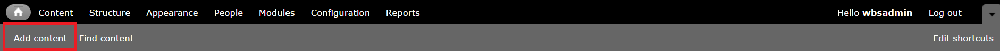
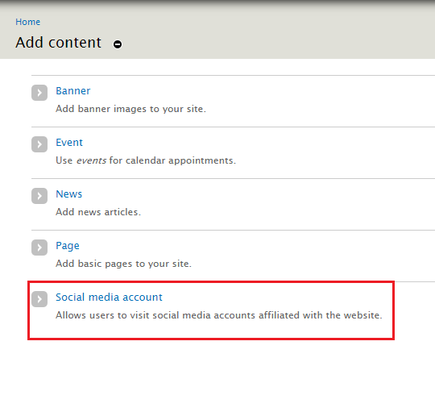
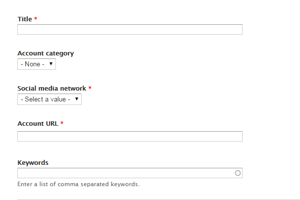
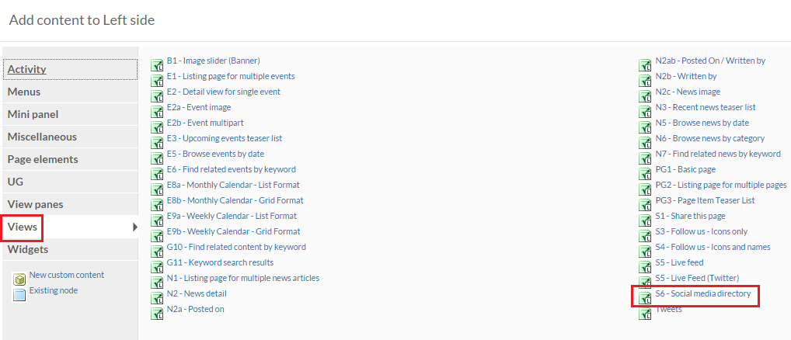
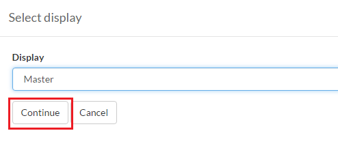
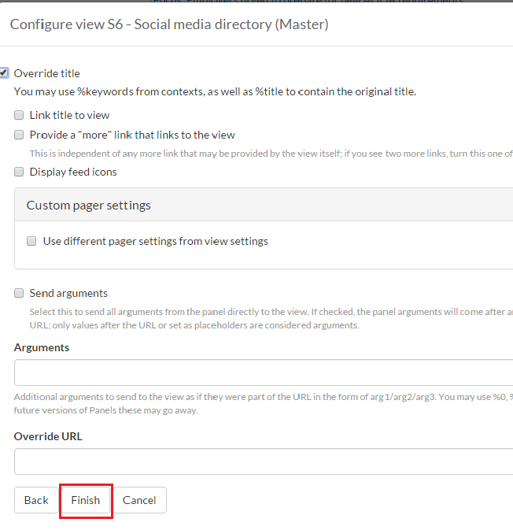

# How to Add Social Media
The social media feature permits **Authors** to add social media links to their website and display them on any page. Site visitors can click on the social media icon and be directed to the associated Web Page.

## To Add Social Media
2. On the Administration bar, select `Add Content`.
 *    
2. Select `Social Media Account`
 * 
3. Enter a **Title**
4. If you have  [Account Category](taxonomies.md#categories) defined, select the appropriate one
5. Select the type of [Social Media Network](taxonomies.md#categories) from the drop down list.
6. Enter your Account URL *Usually found by going to your social media homepage and saving*
7. Enter any *Tags or Keywords* that may assist in categorizing and organizing your social media.
 * 
8. Select **Save** when you are done.
 * 

To add the the content to a detail page:

1. Go back to the *Home page* and select `Customize this page` at the bottom of the Web Page.
 * 
2. Choose any of the location areas to place your social media link (i.e. top, middle column, right side, etc) and select `+`
  * 
3. Click on `View Panes` and select either `S3` or `S4` views depending on your needs.
  * 
4. Select `Continue`
  * 
5. Select `Finish`
  * 
