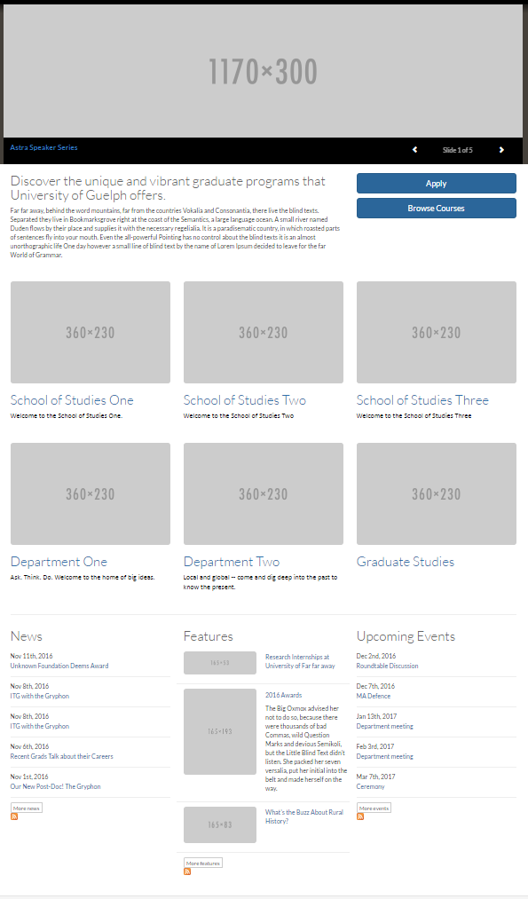
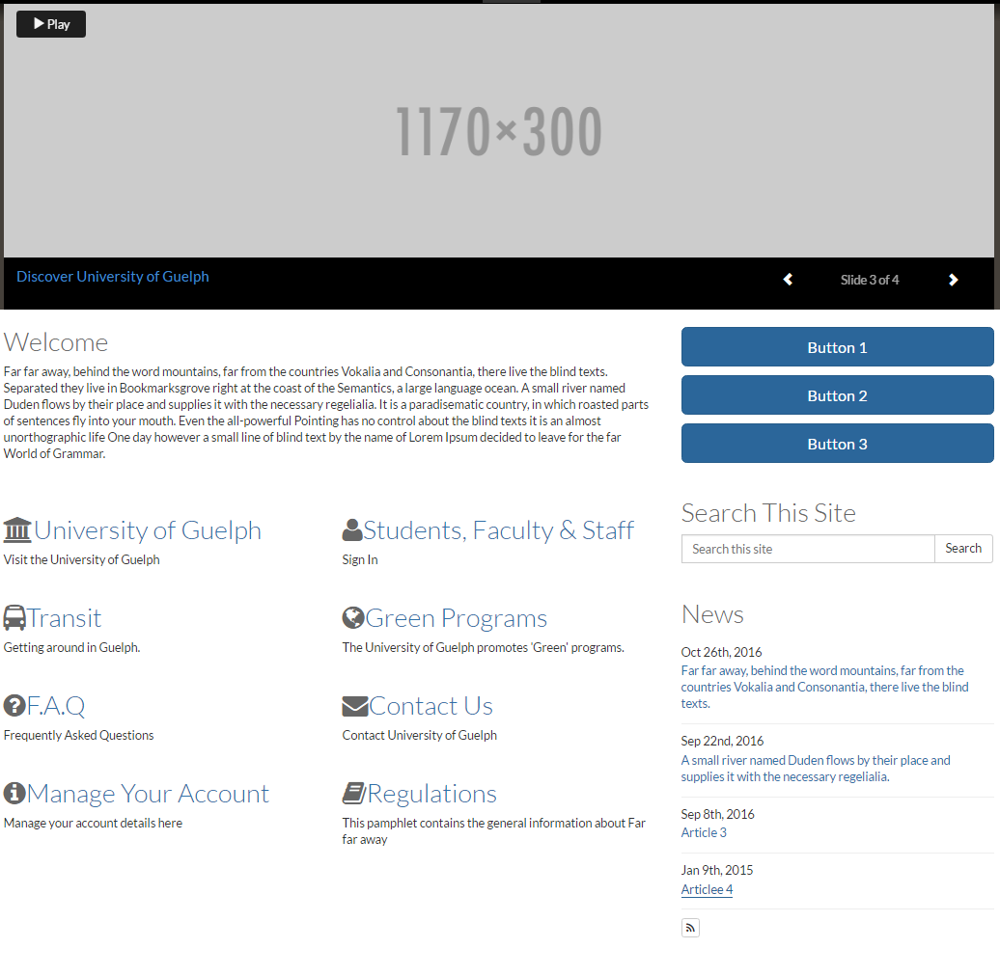
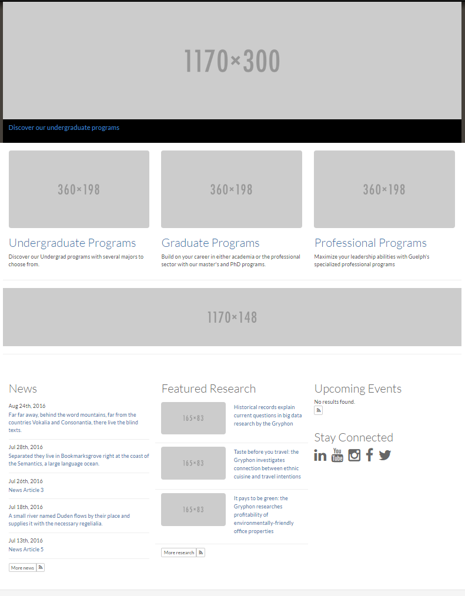
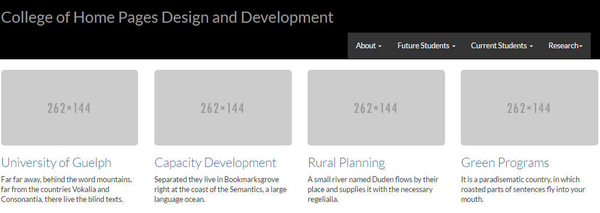

# Home Page Layout Options

Below are different layouts that are availiable with our platform. If you would like to use the layouts below, please contact a member of the AODA Web Team for help. A combination of the following layouts can be used to design a home page:

## Layout 1: Intro area with two main buttons. Grid below it with 3 columns and 2 rows, used for section lead-ins. News, Features, and Upcoming Events located at the bottom of the page.

## Layout 2: Intro area with three main buttons. Right below intro are Links with icons to main sections of the website. Search and News located to the right of the links.

## Layout 3: 3 column top level lead-ins. Info banner midway through the page. News, Features, Upcoming Events, and Stay Connected at the bottom of the page.

## Layout 4: 4 column top level lead-ins

