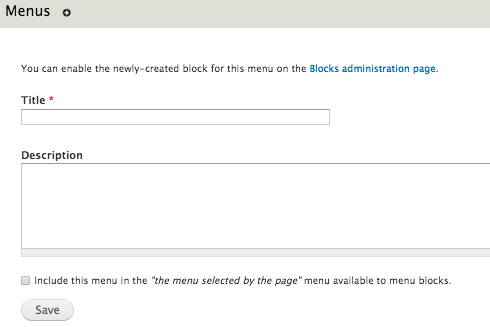
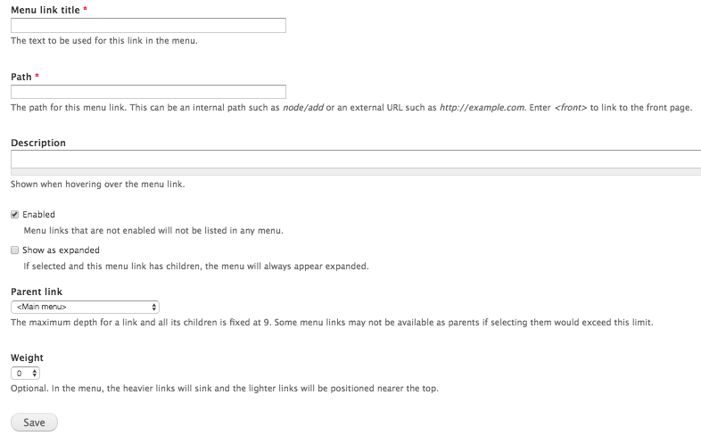

# Managing Menus

Menus are a collection of links (menu items) that are used to navigate a
website. Site Managers have the ability to remove, add, and rename menus
and menu items/tabs. Editors can only add menu items to existing menus.

* [Creating a New Menu](menuitems.md#creating-a-new-menu)
* [Editing a Pre-existing Menu](menuitems.md#editing-a-pre-existing-menu)
* [Adding/Editing Menu Links](menuitems.md#adding--editing-menu-links)
* [Adding Content to a Menu](menuitems.md#adding-content-to-a-menu)
* [Using Categories in Menus](menuitems.md#using-categories-in-menus)

## Creating a New Menu

1. Select `Structure` on the Admininistration Bar.
2. Select `Menus`.
3. Select `Add Menu`.
   
4. Enter the title you would like to give the menu in the "Title" field.
5. Enter the description you would like to give the menu in the "Description" field (optional). The description is not seen by site users.
7. Once completed, select `Save`.

## Changing Menu Name & Description
1. Select `Structure` on the Admininistration Bar.
2. Select `Menus`. 
3. Locate the menu you would like to edit.
4. Select `edit menu`.
5. Make the required changes. Select `Save`.

### Adding a Link to the Menu
1. Select `Structure` from the Admininistration Bar.
2. Select `Menus`. 
3. Locate the menu you would like to configure.
4. Select `list links` to edit the menu.
2. Select `Add Link`. On the new page, fill out the following:
   
3. Enter the title for the menu item in the "Menu link title" field.
4. Enter the path where the menu item leads in the "Path" field. **/!\ Note**: use relative links instead of absolute links.
5. Enter a description if needed.
6. If the menu item is a "parent" item for a dropdown menu, check `Show as expanded`.
7. If you know the correct weight to give the item then you may change the weight here. Otherwise, you can use the interface on the previous page to reorder the menu items. **/!\ Note**: You can configure menu hierarchy through the drag interface.
8. Once the above steps are completed, select `Save`.

### Editing a Link in the Menu
1. Select `Structure` from the Admininistration Bar.
2. Select `Menus`. 
2. Locate the menu item you would like to edit.
3. Select `edit`. To delete the link, select `delete`.
4. Once you have finished editing the menu link options, select `Save`.

## Adding Content to a Menu
Located at the bottom of the content type edit page, there is the option to add the selected content item to a menu.

1. Select `Menu Settings`.
2. Ensure `Provide a menu link` is checked.
3. Enter the content's title in the "Menu Link Title" field.
4. Enter a description in the "Description" field.	By adding a description, if a user's mouse hovers over this link, after a moment the description you type here will show.
5. Choose the menu parent item for the content type to be nested under by using the "Parent Item" dropdown menu. 
6. You can adjust the weight of the page by using the "Weight" dropdown menu. A higher (heavier) weight means that the item will appear at the bottom of its menu list. Negative integers represent lower (lighter) weights, and will float to the top. The range of weights is -50 to 50.
7. Once completed, select `Save`.

## Using Categories in Menus
The menus on your site can call for items that match specific taxonomy terms. 

To create a menu using Taxonomy, follow these steps:

1. Find the autopath given to your taxonomy term by following these steps:
    1. Select `Structure` on the Admininistration Bar.
    2. Select `Taxonomy`. 
    3. Locate the vocabulary name you would like and then click `list terms`.
    4. Select the term from the list of terms.
    5. Save/Copy the URL at the top of the page.
2. Once the above step is completed, select `Structure` on the Admininistration Bar.
3. Select `Menus`. 
3. Select `Add Link`. On the new page, fill out the following:
   
4. Enter the title for the menu item in the "Menu link title" field.
5. Enter the path you copied in step one in the "Path" field.
6. Enter a description if needed.
8. If you know the correct weight to give the item then you may change the weight here. Otherwise, you can use the interface on the previous page to reorder the menu items. **/!\ Note**: You can configure menu hierarchy through the drag interface.
9. Once the above steps are completed, select `Save`.
