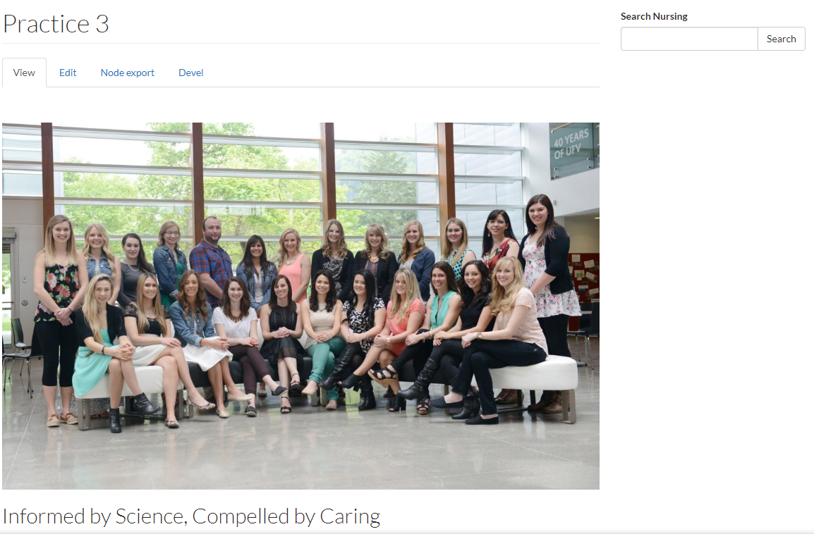

# Customizing Site Search

The following are two different options for placement of a Search Box form on your website.

## Option 1: Placing Search Box Using Customize this page

Search box is placed on the right-hand side of the page using **Customize this page.**

**Note:** Edits made using "Customize this page" will affect all pages of the same content type. \(E.g., An edit made to an Event page will affect all event pages on the site\)

### How to Implement Option 1

1. Navigate to any Basic Page on your website. 
2. Select `Customize this page` at the middle-bottom of the page
3. The page has been broken down into sections. Scroll down until you reach “Right Side”

1. On the right-hand side, click the plus sign
2. A menu will appear. Select `Widgets` from the left-hand column
3. Select `Search Form`
4. Select `Finish`

It should look like this:

1. To reposition the search form, use the anchor tool to click and drag to desired position \(above or below existing widgets\).
2. Select `Save` at the middle-bottom of the page

Now the search box should appear on every Basic Page content type. To have the search box enabled on other content types such as News or Events, simply navigate to an event or news content page and repeat the steps above.

## Option 2: Link to Search Added to Main Menu Bar

A link is added to the Main Menu Bar that takes the user to the Search page.

 

### How to Implement Option 2

1. Select `Structure` from the Administration Menu Bar, then select `Menus`
2. Click `list links` located to the far right of the "Main Menu" item
3. At the top of the page, select `Add link`
4. Input the following into the fields
   * **Menu Link Title:** Search
   * **Path:** search
   * Choose `save` at the bottom of the page
5. You will now find the "Search" lin at the bottom of the Menu Link List 

1. Click and drag the anchor on the left of Search to position the Search menu link in the list
2. Click `Save configuration` at the bottom of the page

You will now have a link in your Main Menu Bar that leads to the Search page.

## How to Add a Search Box to your Homepage

1. Navigate to the homepage. Select `Customize this page`
2. You will see your homepage broken down into sections. Under the Right Side section, select the + 
3. A menu will appear. Select `Widgets` and then `Search form`
4. Select `Finish`
5. Select `Save` at the bottom of the page 

You have successfully added a Search Box to your homepage.

