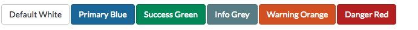
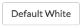
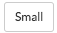
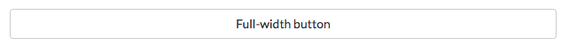
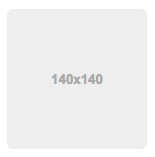
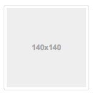
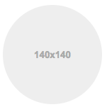
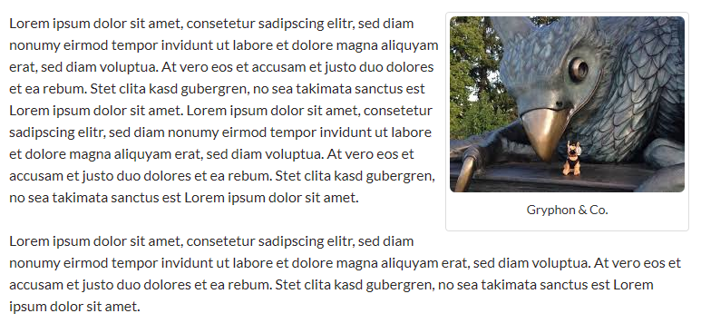
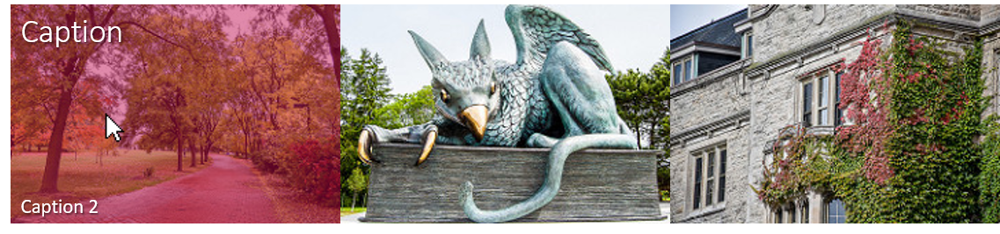
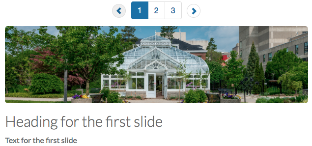

# Style Guide Code Snippets

When trying to include the following content into your side, please use the following guide to assist you with structuring and styling content on a page within the AODA Drupal Theme. Many of the recommended code snippets are from the Bootstrap Framework. Visit [Bootstrap CSS](http://getbootstrap.com/css/) for a full list of CSS classes. Please note that a majority of the following information requires a high level of technical understanding and general knowledge of web development.

* [Buttons](styleguide.md#buttons)
  * [Button vs Link](styleguide.md#button-vs-link)
  * [Bootstrap Button Colors](styleguide.md#bootstrap-button-colours)
  * [Bootstrap Button Sizes](styleguide.md#bootstrap-button-sizes)
  * [Exapnding and Collapsing Buttons](styleguide.md#expanding-and-collapsing-buttons)
* [Images](styleguide.md#images)
  * [Rounded Images](styleguide.md#rounded-images)
  * [Aligning Images](styleguide.md#aligning-images)
    * [Centering Images](styleguide.md#centering-images)
      * [Floating Images Left](styleguide.md#floating-images-left)
      * [Floating Images Right](styleguide.md#floating-images-right)
      * [Clearing Floating Images](styleguide.md#clearing-floated-images)
  * [Images with Captions](styleguide.md#images-with-captions)
  * [Creating a Responsive Image Grid with Bootstrap](styleguide.md#creating-a-responsive-image-grid-with-bootstrap)
    * [2 Column Responsive Image Grid](styleguide.md#2-column-responsive-image-grid)
      * [3 Column Responsive Image Grid](styleguide.md#3-column-responsive-image-grid)
  * [Image Overlay](styleguide.md#image-overlay)
    * [Image Overylay with Single Heading Caption](styleguide.md#image-overlay-with-single-heading-caption)
      * [Image Overylay with Two Captions](styleguide.md#image-overlay-with-two-captions)
* [Slideshows](styleguide.md#slideshows)
* [Templates](styleguide.md#templates)
  * [Two Columned List](styleguide.md#two-columned-list)
  * [Listing Text Content with a Left-Aligned Image](styleguide.md#listing-text-content-with-a-left-aligned-image)
  * [Heading that Expand and Collapse sections](styleguide.md#headings-that-expand-and-collapse-sections)
  * [Equal Height Boxes](styleguide.md#equal-height-boxes)
* [Miscellaneous](styleguide.md#miscellaneous)
  * [Icons](styleguide.md#icons)

## Buttons

The following code snippets demonstrate the style classes you would use to style a button or a link so that it looks like a button. You can control the colour and size of each button. 

### Button vs Link?

If clicking the button causes the user to go to a different page, use a link.

```markup
<a href="#" class="btn btn-default">Link styled as a button</a>
```

If clicking the button triggers a change on the page \(but does not go to a different page\), use a button.

```markup
<button class="btn btn-default">Button that causes a change on the current page</button>
```

### Bootstrap Button Colours

#### Default / White



```markup
<!-- Standard button style -->
<button type="button" class="btn btn-default">Default</button>
<a href="#" class="btn btn-default">Default</a>
```

#### Primary / Blue


```markup
<!-- Identifies the primary action in a set of buttons -->
<button type="button" class="btn btn-primary">Primary</button>
<a href="#" class="btn btn-primary">Primary</a>
```

#### Success / Green


```markup
<!-- Indicates a successful or positive action -->
<button type="button" class="btn btn-success">Success</button>
<a href="#" class="btn btn-success">Success</a>
```

#### Info / Grey


```markup
<!-- Contextual button for informational alert messages -->
<button type="button" class="btn btn-info">Info</button>
<a href="#" class="btn btn-info">Info</a>
```

#### Warning / Orange


```markup
<!-- Indicates caution should be taken with this action -->
<button type="button" class="btn btn-warning">Warning</button>
<a href="#" class="btn btn-warning">Warning</a>
```

#### Danger / Red


```markup
<!-- Indicates a dangerous or potentially negative action -->
<button type="button" class="btn btn-danger">Danger</button>
<a href="#" class="btn btn-danger">Danger</a>
```

### Bootstrap Button Sizes

#### Large


```markup
<!-- Large button: This can be done with any of the aforementioned colours  -->
<button type="button" class="btn btn-default btn-lg">Large</button>
<a href="#" class="btn btn-default btn-lg">Large</a>
```

#### Small



```markup
<!-- Smallbutton: This can be done with any of the aforementioned colours  -->
<button type="button" class="btn btn-default btn-sm">Small</button>
<a href="#" class="btn btn-default btn-sm">Small</a>
```

#### Full Width



```markup
<!-- Full Width Button: This can be done with any of the aforementioned colours  -->
<button type="button" class="btn btn-default btn-block">Full-width button</button>
<a href="#" class="btn btn-default btn-block">Full-width button</a>
```

### Expanding and Collapsing Buttons

The following code snippets demonstrates a button toggle that will show or hide the section of text below it. Replace 'uniqueNameForControl' with a unique name for the code snippet. Every time you use this snippet on a page, you will need to provide a different 'uniqueNameForControl' for that particular code snippet \(eg. uniqueName1, uniqueName2, uniqueName3, etc.\).

```markup
<h2><button aria-controls="uniqueNameForControl" aria-expanded="false" class="btn btn-primary" data-target="#uniqueNameForControl" data-toggle="collapse" type="button">More Info about Expandable Section</button></h2>
<div aria-expanded="false" class="collapse" id="uniqueNameForControl" role="region">
   <p>Content that will be shown or hidden using the button</p>
</div>

<h2><button aria-controls="uniqueNameForControl2" aria-expanded="false" class="btn btn-primary" data-target="#uniqueNameForControl2" data-toggle="collapse" type="button">More Info about Expandable Section</button></h2>
<div aria-expanded="false" class="collapse" id="uniqueNameForControl2" role="region">
   <p>Content that will be shown or hidden using the button</p>
</div>
```

## Images

### Rounded Images

This demonstrates an image with rounded corners using the img-rounded class.

```markup

```



This demonstrates an image with rounded square corners and a border using the img-thumbnail class.

```markup

```



This demonstrates a circular image using the img-circle class.

```markup

```



### Aligning Images

#### Centering Images

Avoid using `<center>` to center images on the page. Instead, use the "center-block" class.

```markup

```

#### Floating Images Left

Use the "pull-left" or "pull-right" classes to float images left or right.

```markup

```

#### Floating Images Right

```markup

```

#### Clearing Floated Images

To clear a float, you can put a "clearfix" class on the parent element.

```markup
<div class="clearfix"></div>
```

### Images with Captions

Use the following code to add a formatted caption to your image

```markup
<figure class="thumbnail">
    
    <figcaption class="caption">Your caption text here</figcaption>
</figure>
```

**Note:** the `img-rounded` class is optional. The code above will provide the following effect:


By default, the border expands to fill available width in the area where the image has been placed. If you don't want that much white space on either side, you can either use a larger image or apply the `pull-left` or `pull-right` class to `figure` like so:

`<figure class="thumbnail pull-right">`

This will give you the following effect instead:



### Creating a Responsive Image Grid with Bootstrap

#### 2 Column Responsive Image Grid

Use the following code to create one row of a 2 column grid. Repeat for as many rows as you need. Remember to replace each `img` element with a decorative image that relates to the associated text link.

```markup
<div class="row">
   <div class="col-md-6 col-lg-6 col-xs-12 col-sm-6">
      <figure class="thumbnail">
         
         <figcaption class="caption"><a href="#">Name of Link 1</a></figcaption>
      </figure>
   </div>

   <div class="col-md-6 col-lg-6 col-xs-12 col-sm-6">
      <figure class="thumbnail">
         
         <figcaption class="caption"><a href="#">Name of Link 2</a></figcaption>
      </figure>
   </div>
</div>
```


#### 3 Column Responsive Image Grid

Use the following code to create one row of a 3 column grid. Repeat for as many rows as you need. Remember to replace each `img` element with a decorative image that relates to the associated text link.

```markup
<div class="row">
   <div class="col-md-4 col-lg-4 col-xs-12 col-sm-4">
      <figure class="thumbnail">
         
         <figcaption class="caption"><a href="#">Name of Link 1</a></figcaption>
      </figure>
   </div>

   <div class="col-md-4 col-lg-4 col-xs-12 col-sm-4">
      <figure class="thumbnail">
         
         <figcaption class="caption"><a href="#">Name of Link 2</a></figcaption>
      </figure>
   </div>

   <div class="col-md-4 col-lg-4 col-xs-12 col-sm-4">
      <figure class="thumbnail">
         
         <figcaption class="caption"><a href="#">Name of Link 3</a></figcaption>
      </figure>
   </div>
</div>
```


### Image Overlay

#### Image Overlay with Single Heading Caption

The following code snippet demonstrates the method you would use to create a linked image with a clickable colour overlay. This overlay also features a caption when hovered over.

Make sure that the Text Format is switched to Full HTML rather than the default Filtered HTML.

```markup
<div class="img-overlay ug-gold">
<a href="/your/link/here">
  
  <span class="overlay-caption h3">Your caption text here</span></a>
</div>
```

 

The defualt overlay colour is black. To change this colour, input `div class="img-overlay ug-gold"`in place of `div class="img-overlay"` Colour options include: `ug-gold` `ug red` `ug blue`

If your desired alt text is the same as your caption text, you can choose to leave the alt text empty. Otherwise, alt text is required If your image was uploaded with text overlaying the image, alt text is also required.

#### Image Overlay with Two Captions

You can create a similar image overlay - but with additional text. This overlay will have a heading caption along the top of the image and a second, smaller caption along the bottom.

This can be done with any of the aforementioned colours.

```markup
<div class="img-overlay ug-red">
<a href="/your/link/here">
  
  <span class="overlay-caption h3">Your caption text here</span>
  <span class="overlay-text">Your extra text here</span>
</a>
</div>
```



## Slideshows

The code below previously contained the code `<div class="carousel-inner" role="listbox">` but now `role="listbox"` is removed so as to make the slideshow accessible. If you had the previous code please remove the `role="listbox"` from the code.

Use the following code to create an inline paginated slideshow.

```markup
<div class="carousel slide" data-interval="false" data-keyboard="true" data-wrap="false" id="carousel-name">

    <div class="carousel-table">
        <a class="glyphicon glyphicon-chevron-left" data-slide="prev" href="#carousel-name" role="button"><span class="sr-only">Previous slide</span></a>

        <ul class="carousel-indicators pagination">
            <li class="active"><a data-slide-to="0" data-target="#carousel-name" href="#">1</a></li>
            <li><a data-slide-to="1" data-target="#carousel-name" href="#">2</a></li>
            <li><a data-slide-to="2" data-target="#carousel-name" href="#">3</a></li>
        </ul>
        <a class="glyphicon glyphicon-chevron-right" data-slide="next" href="#carousel-name" role="button"><span class="sr-only">Next slide</span></a>
    </div>

    <div class="carousel-inner">
        <div class="item active">
            <h2>Heading for the first slide</h2>
            <p>Text for the first slide</p>
        </div>

        <div class="item">
            <h2>Heading for the second slide</h2>
            <p>Text for the second slide</p>
        </div>

        <div class="item">
            <h2>Heading for the third slide</h2>
            <p>Text for the third slide</p>
        </div>
    </div>
</div>
```



## Templates

### Two Columned List

This code snippet demonstrates the method you would use to create a list with two columns.

```markup
<div class="row">
    <div class="col-sm-4">
        <ul>
            <li>Column 1 List Item 1</li>
            <li>Column 1 List Item 2</li>
            <li>Column 1 List Item 3</li>
        </ul>
    </div>

    <div class="col-sm-4">
        <ul>
            <li>Column 2 List Item 1</li>
            <li>Column 2 List Item 2</li>
            <li>Column 2 List Item 3</li>
        </ul>
    </div>
</div>
```


### Listing Text Content with a Left-Aligned Image

This code snippet demonstrates the method you would use to create a listing of content with a left-aligned image with text.

```markup
 <div class="media-listing-page">
  <article class="row media">
    <div class="col-md-4">
      <div class="media-thumbnail"></div>
    </div>

    <div class="col-md-8">
      <header class="media-header">
        <h2 class="media-heading">heading</h2>
      </header>

      <div class="media-summary">
        <p>paragraph text</p>
       </div>
     </div>
  </article>
 </div>
```

### Notes:

* Add more `<article class='row media'>` tags to add new content
* Only need a single "media-listing-page" tag around all article tags
* You may need to use "Full HTML" mode before entering this HTML code. Note that only site managers have access to this mode.


## Headings that Expand and Collapse Sections

Start with content that has a heading, e.g.

```markup
<h2>Section Title</h2>

<p>Section text here</p>
<p>More text here</p>
```

To make the section collapsible, it needs to be wrapped in `div` tags like this:

```markup
<div>
<p>Section text here</p>
<p>More text here</p>
</div>
```

After you've put the content in a div, give that div the class name `collapse` and a unique ID:

```markup
<div class="collapse" id="uniqueID">
<p>Section text here</p>
<p>More text here</p>
</div>
```

Now turn your section title into a link with the following code:

```markup
<h2><a href="#uniqueName" data-target="#uniqueName">Section Title</a></h2>
```

Note that `href` and `data-target` both have to equal the unique ID of the div. This is so the link, when clicked, knows which div it's supposed to expand or collapse. So If you want multiple divs on page that can be expanded or collapsed, each one must have a unique ID.

**Note:** If you want a section to be expanded by default when a page loads instead of hidden/collapsed, rewrite the link heading code as follows:

```markup
<h2><a data-toggle="collapse" data-target="#section2" href="#section2">Section title here</a></h2>
```

That is, remove the code `class=collapsed` \(when you include `class=collapsed`, it makes the link show up with a "Plus" icon to indicate the content can be expanded. This "Plus" icon changes to a "Minus" when the content is expanded\). You also need to change the section's `div` code from:

```markup
<div class="collapse">
```

to:

```markup
<div class="collapse in">
```

## Equal Height Boxes

**Note as of 10/20/2017:** This will be available in the next release, v23.0


Code for the boxes is structured as follows:

```markup
<div class="row row-flex row-flex-wrap">
    <div class="col-md-4">
        <div class="flex-col well">
            <ul class="flex-grow list-narrow">
                <li>Lorem ipsum</li>
                <li>Dolor sit amet</li>
                <li>Consectetur adipiscing</li>
                <li>Sed do eiusmod</li>
                <li>Tempor incididunt</li>
                <li>Labore et dolore</li>
            </ul>
            <p class="rtecenter"><a href="#" class="btn btn-info btn-sm">Learn more</a></p>
        </div>
    </div>
</div>
```

Code for the box container is:

```markup
<div class="row row-flex row-flex-wrap"> ... </div>
```

Code for an individual box is:

```markup
<div class="col-md-4">
    <div class="flex-col well">
        <ul class="flex-grow list-narrow">
            <li>Lorem ipsum</li>
            <li>Dolor sit amet</li>
            <li>Consectetur adipiscing</li>
            <li>Sed do eiusmod</li>
            <li>Tempor incididunt</li>
            <li>Labore et dolore</li>
        </ul>
        <p class="rtecenter"><a href="#" class="btn btn-info btn-sm">Learn more</a></p>
    </div>
</div>
```

The bootstrap class `col-md-4` means you'll have, if screen space permits, a maximum of 3 boxes in a row. The `flex-col` class ensures the button always appears under the list of items \(as opposed to, say, floating right next to it\). The `well` class is optional for getting the grey background and border effect.

The `flex-grow` class, applied to the list, pushes the button down to the bottom of the box \(as opposed to right beneath the list\). The `list-narrow` class is optional, meant for applying a smaller font size and shorter line heights \(as opposed to how default body text looks\).

## Miscellaneous

### Icons

#### Icon Only

We are currently using the FontAwesome icon library. To use the icons, make sure to put a non-breaking space between the tags, otherwise ckeditor will remove the icon code when you edit it. For Example:


```markup
<i class="fas fa-ghost">&nbsp;</i>
```

Different icons may use a different set of classes \(eg. "fab" for brand icons\):


```markup
<i class="fab fa-snapchat">&nbsp;</i>
```

See the official documentation at: [https://fontawesome.com/how-to-use/on-the-web/referencing-icons/basic-use](https://fontawesome.com/how-to-use/on-the-web/referencing-icons/basic-use)

The cheatsheet of all the available icons is at: [https://fontawesome.com/cheatsheet](https://fontawesome.com/cheatsheet)

#### Icon with Link Text/Text


```markup
<h2><i aria-hidden="true" class="fa fa-university fa-lg">&nbsp;</i><a href="www.uoguelph.ca">University of Guelph</a></h2>
```

#### How do I view all available icons, class names, character codes and aliases?

* Font Awesome provides a cheatsheet page where all of that information can be found: [http://fontawesome.io/cheatsheet/](http://fontawesome.io/cheatsheet/)

#### How do I increase the size of my icon?

* To increase icon sizes relative to their container, use the `fa-lg` \(33% increase\), `fa-2x`, `fa-3x`, `fa-4x`, or `fa-5x` classes.

  ```markup
  <i class="fa fa-university fa-lg">&nbsp;</i>
  <i class="fa fa-university fa-2x">&nbsp;</i>
  <i class="fa fa-university fa-3x">&nbsp;</i>
  <i class="fa fa-university fa-4x">&nbsp;</i>
  <i class="fa fa-university fa-5x">&nbsp;</i>
  ```

