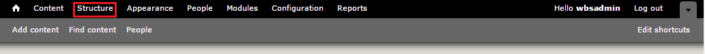

# Taxonomies

## Summary
*Taxonomy* is the practice of classifying content. In *Drupal*, the
taxonomy module allows you to classify your website content, and it can
be an important part of your information architecture. This module is
beneficial for everything from menu and navigation organization, to view
& display options.

## Planning Taxonomies
The first step in establishing a taxonomy is creating a new vocabulary. Next you provide the terms that fall within that vocabulary. The arrangement can be "flat", as in a tagging system, or hierarchical, with parents and children. The university of Guelph's Drupal framework treats all terms as flat within the defined vocabulary.

An example of how you might create taxonomy for a site using our
predefined vocabularies:

**Vocabulary = Page Category**

**Term = Workshops**

Our platform uses a *controlled vocabulary*, where only Site Managers
can assign terms to vocabularies. Site Managers must add the terms in
advance.

## Taxonomy Principles
* Each vocabulary consists of a set of terms associated with a particular feature.
* Each vocabulary can contain an unlimited number of terms.
* *Keywords* are a type of "tagging" vocabulary shared amongst all that can be used as a general keyword filter.

## Working With Taxonomies
Vocabularies are managed on the Taxonomy page.
* It is found under `Administration Bar -> Structure` (i.e. http://yoururl/admin/structure/taxonomy)

### Adding Terms
The University of Guelph Drupal 7 template comes with a list of predefined vocabularies used by multiple UoG Modules. Most of these may need to be filled with terms.

You may populate vocabularies with terms using `Add Term`.
1. Navigate to `Structure -> Taxonomies`
2. Select `Add Term` for the vocabulary you want to edit. From there, Drupal will prompt for:

* **Term name (Required)** - The name for this term. Example: Technology.
* **Description (Optional)** - Description of the term (this item may be used by some modules and feeds but is not required).

To view or manage the terms of each vocabulary:

1.  Navigate to `Structure -> Taxonomies`
2.  Click on its `list terms` link
3.  On the `list terms` page you can edit each term by clicking the
    `edit` link. On the edit term page you have several choices:
-   You must assign your term a name as a “nameless term” does
    not exist.
-   You can delete a term altogether.

On the `list terms` page you can edit each term by clicking the `edit` link. You can delete a term from the edit page.

### Filtering with Taxonomies

The taxonomy filter is designed to assist narrowing down taxonomy
listings to find topics that are tagged by multiple terms.
