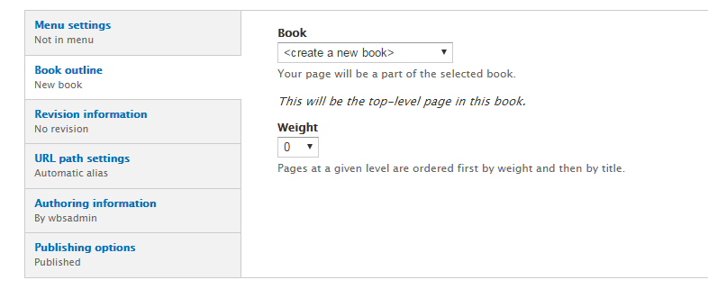
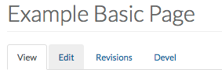

# Book

* [Creating a Book](howto-book.md#creating-a-book)
* [Editing a Book Page](howto-book.md#editing-a-book-page)
* [Deleting a Book Page](howto-book.md#deleting-a-book-page)
* [Attaching a File to a Book](howto-book.md#attaching-a-file-to-a-book)
* [Assigning a Category to a Book](howto-book.md#assigning-a-category-to-a-book)

The Book Feature permits **content creators** to organize content into ordered sections, similar to the chapters and pages of physical books.

Books have a built-in hierarchical navigation, which means that they can be organized to be read in a particular order. Each book page contains a link to its parent page, as well as to the previous and next pages in the order specified.

## Creating a Book

1. On the Administration bar, select `Add Content`.

   

2. Select `Book Page`.
3. Enter the title of the book in the "Title" field.
4. If you have [book categories](../basicbeginner/taxonomies.md) defined, select the appropriate one. For more information, please see the [Assigning a Category to a book](howto-book.md#assigning-a-category-to-a-book) section.
5. Use the [Drupal Text \(WYSIWYG\) Editor](../basicbeginner/wysiwyg-editor.md) to fill the book with your desired content.
6. If you want to add any files \(PDF, Docs, Images\) to be attached to the book page and available for download by the user, you can do so by attaching them using the "File Attachment" option. For more iinformation, please see the [Attaching a File to a Book](howto-page.md#attaching-a-file-to-a-page) section.
7. Enter any _tags_ or _keywords_ that help categorize and organize your book page.
8. Under `Book outline`, select the book you want to publish the page to. If this is the first page of a new book, select the `create a new book` and enter the appropriate information.  

   

9. Under Book Outline, you have two options as to where to place the new Book Page:
   1. **Create a new book**: This will create a new Book and make the current page the "Top Level Page".
   2. **pick from previously created books**: This will add the book page to an already existing book. You have the ability to choose the location of the new page within the book. If adding a book page to a specific book, it is important to add a **Parent item** in the book and select the appropriate "weight" for the page.

      
10. If you have the [proper authority](../rolesandresp.md) to publish right away, ensure that the `Published` checkbox is checked under "Publishing options".
11. Once the above steps are completed, select `Save`.

## Editing a Book Page

**/! Note**: Only one user can edit a book page at a time. If multiple users are editing a book page then content may be unsaved or lost.

1. Navigate to the book page you would like to edit.
2. Once you are at the book page you would like to edit, select `Edit`.

   

3. Edit the content on the book page by using the Drupal Text \(WYSIWYG\) Editor.
4. Once you have completed the above steps, select `Save`.

## Deleting a Book Page

**/! Note**: If the book page is a parent item in a menu for other book pages, the book page will be deleted from the book page hierarchy.

1. Select `Find Content` on the Administration Bar.
2. Find the book page you would like to delete. **!IMPORTANT!**:Ensure you are deleting the correct book page.
3. Select `delete`.

## Attaching a File to a Book

In order to attach a file to a book, the file must be **less than 20MB** and one of the following formats:

* .txt 
* .pdf  
* .doc   
* .docx  
* .rtf  
* .png 
* .gif
* .jpg
* .jpeg
* .zip
* .xls
* .xlsx
* .ppt
* .pptx
* .csv
* .dmg

To attach a document to the book, please follow these steps:

1. Navigate to the book you would like to edit.
2. Select `Edit`.
3. Navigate to the "File Attachments" section.

   

4. Select the `Choose file` button and navigate to the file you would like to attach.
5. Select `Upload`.
6. Once the file is uploaded, it will appear in the file attachments table.

   

7. For each attachment, you have the following options:
   * **Description Field**: Provide a description for the file so the user knows what the file contains. 
   * **Display Checkbox**: If checked, the book attachment is visible to all users. If unchecked, the file is still attached to the book page and may be linked to, but it is not visible to site users. 
   * **Remove Button**: Once selected, the attacment is removed.

## Assigning a Category to a Book

Book categories allow for Books to be sorted via the given term/category.

**/! Note**: The following steps assume that the book category has already been created.

1. Navigate to the book you would like to edit.
2. Select `Edit`.
3. Select the category you would like to place the book under using the dropdown menu under "Book Category."
4. Select `Save`.

