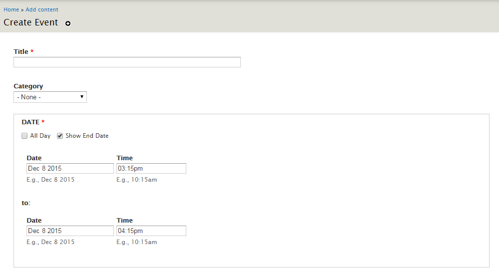

# Events

The Events feature allows **Content Creators** to add events to the website and display them in a Listing Page view, a Weekly Events view, a Monthly Calendar view, an Event Detail Page view, and an Upcoming Events Teaser List view. Any event can be featured on any page using the Featured Items block. Site visitors can also browse for events by date and event category.

## To Create an Event

1. From the top administration bar, navigate to `Add Content` &gt; `Event`.
2. Enter a **Title**.
3. Enter the starting and ending **Dates and Time**.

   

4. Enter a **Location**.

   

5. In the **Body field**, enter information about the event.

   

6. Select your **Section** if you have defined one.
   * For sections, a **Taxonomy** for `Event_headings` needs to be created by the Site Manager. Example Sections: _Cost_, _Extra Directions_, _Dinner Menu Items_. Sections are optional.
7. Add a `feature image` if there is one for the event, such as a poster image. Images must be no smaller than 200x160 pixels and no larger than 1140x570 pixels.
8. Add a descriptive **Alternative Text**. 
9. **Caption** is optional.

   

10. Add any files relevant to the Event and enter, and/or a related website with a descriptive title.
11. If you have the proper authority to publish, select `Published` in "Publishing options."
12. Select `Save`.

