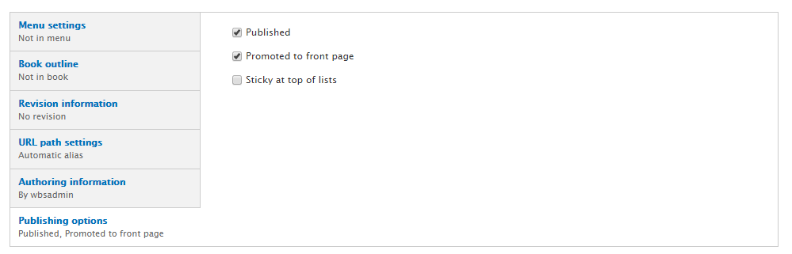

# Featured Item

The _Featured Item_ allows **Content Creators** to create a lead-in to any page content on the website \(e.g. Events, News, Basic Page, People Profiles, etc.\) or an external URL. Featured Items are usually set to be displayed on the front page.

* [Creating a Featured Item](howto-featured.md#to-create-a-featured-item)
* [Featured Item Views](howto-featured.md#featured-item-views)
* [Features Listing Page](howto-featured.md#features-listing-page)

## To Create a Featured Item

1. From the top administration bar, navigate to `Add Content` &gt; `Feature`.
2. Enter a **Title**.
3. If you have [page categories](../basicbeginner/taxonomies.md) defined, select the appropriate one.
4. Upload an **Image** for the Featured Item by selecting `choose file`.
   * Add descriptive **alternative text**. If the image is a link, the alt text must describe the destination.
   * Featured images should be 760x570px and should pertain to the subject matter.
5. Enter the direct link to the Featured Item, such as an Event or News Article page, in the "Link" field.

   

6. Enter a short **Summary**.
7. Enter a few **Keywords** to help tag the Featured Item.

   

8. If you have the proper authority to publish, select `Published` in "Publishing options."

   

9. Select `Save`.

## Featured Item Views

In-Place Editor allows you to arrange panes and edit some settings on the fly. 1. On the main page, select **Customize this page**.

1. Choose any of the location areas to place a new view \(i.e. top, middle column, right side, etc.\) and select `+`.

   

2. Select `View Panes` and then select either `FT3` or `FT3 - Random` views, depending on your needs.

   

3. Select `Continue`.
4. Select `Finish`.

## Features Listing Page

If you navigate to www.uoguelph.ca/sitename/features, you will find the Features listing page, where a list of all your features is stored.

This listing page can also be filtered by categories and keywords. This is useful if your website houses multiple departments with their own features, or if different features pertain to different audiences.

To filter features, add terms to the "Feature category" vocabulary under `Structure` &gt; `Taxonomy`.

Add Keywords by navigating to `Structure` &gt; `Taxonomy` &gt; `Tags`.

For more information on categories and keywords, see the [Taxonomies](../basicbeginner/taxonomies.md) page.

