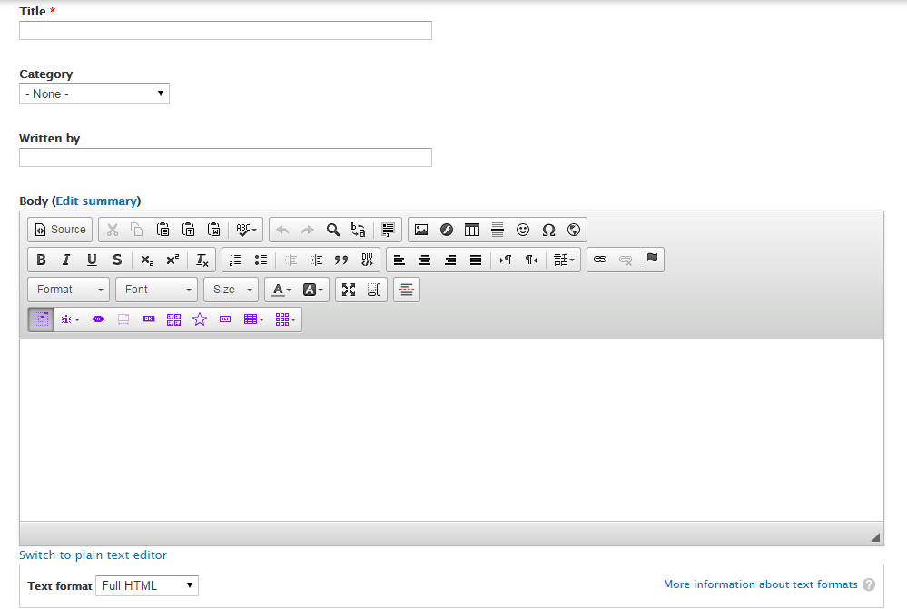

# News

The _News_ feature allows **Content Creators** to add news articles to the website and display them in a Listing Page view, an Article Detail Page view, and a Recent News Teaser List view. Any article can be featured on any page using the Featured News Article view. Site visitors can also browse for news articles by date and category tag.

## 

## To Add a News Article

1. On the Administration bar, navigate to `Add Content` &gt; `News`.
2. Enter a **Title**.
3. If you have [news categories](../basicbeginner/taxonomies.md) defined, select the appropriate one.
4. Enter a **Written by** personal or organizational name.
5. In the body field, enter what you want displayed on your web page. [Here is more information on how to use the WYSIWYG editor.](../basicbeginner/wysiwyg-editor.md)
   * 
6. Add a feature image if there is one for the news, such as an image of the subject matter. **Alternative Text** is required if the image is not a decorative one. Images must be no smaller than 640x240 pixels and no larger than 1140x570 pixels.
7. Add a **Caption**.
   * 
8. Enter any _tags_ or _keywords_ that help categorize and organize your article.
9. If you have the proper authority to publish, select `Published` in "Publishing options."
10. Select `Save`.

