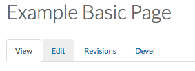
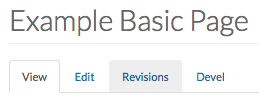
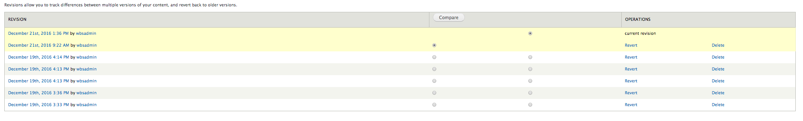

# Page

* [Creating a Page](howto-page.md#creating-a-page)
* [Editing a Page](howto-page.md#editing-a-page)
* [Deleting a Page](howto-page.md#deleting-a-page)
* [Attaching a File to a Page](howto-page.md#attaching-a-file-to-a-page)
* [Assigning a Category to a Page](howto-page.md#assigning-a-category-to-a-page)
* [Page Keywords](howto-page.md#page-keywords)

The **Page** content type is used for static content that can be linked into the main navigation bar. This is one of the most basic content types and is very flexible.

## Creating a Page

1. From the Administration bar, navigate to `Add Content` &gt; `Page`.
2. Enter the title of the page in the "Title" field.
3. If you have [page categories](../basicbeginner/taxonomies.md) defined, select the appropriate one. For more please see the [Assigning a Category to a Page](howto-page.md#assigning-a-category-to-a-page) section.
4. Use the [Drupal Text \(WYSIWYG\) Editor](../basicbeginner/wysiwyg-editor.md) to fill the page with your desired content.
5. If you want to attach any files \(PDF, Docs, Images\) to the page and be availiable for download by the user, you can do so using the "File Attachment" option. For more please see the [Attaching a File to a Page](howto-page.md#attaching-a-file-to-a-page) section.
6. If you want this web page to be accessed through your website menus, visit the [Managing Menus](https://github.com/ccswbs/UoGd7-Training/tree/aa9e2af0dea5bf798b73544e291e912caea4a6e4/menuitems.html#adding-content-to-a-menu) section.
7. If you have the [proper authority](../rolesandresp.md) to publish, ensure that the `Published` checkbox is checked under "Publishing options."
8. Once the above steps are completed, select `Save`.

## Editing a Page

**/! Note**: Only one user can edit a page at a time. If multiple users are editing a page then content may be unsaved or lost.

1. Navigate to the page you would like to edit.
2. Once you are at the page you would like to edit, select the `Edit` option.

   

3. Edit the content you would like to edit on the page by using the Drupal Text \(WYSIWYG\) Editor.
4. Once you have completed the above steps, select `Save`.

### Reverting a Page

If you would like to go back to a previous version of the page, follow these steps:

1. Navigate to the page you would like to edit.
2. Once you are at the page you would like to edit, select `Revisions`.

   

3. You will see a page that lists the previous versions of the page. Every time a page is saved a new revision version is created.

   

4. You can compare revisions by selecting two versions of the page and selecting `Compare`.

## Deleting a Page

**/! Note**: If the page is a parent item in a menu for other pages, the page will be deleted but not removed from the menu structure. Therefore, if selected, the user will encounter a [404 Error](../basicbeginner/#common-web-errors).

1. Select `Find Content` on the Administration Bar.
2. Find the page you would like to delete. **!IMPORTANT!**:Ensure that the page selected is the page you would like to delete. 
3. Select `delete`.

## Attaching a File to a Page

In order to attach a file to a page, the file must be **less than 20MB** and in one of the following formats:

* .txt
* .pdf
* .doc
* .docx
* .rtf
* .png
* .gif
* .jpg
* .jpeg
* .zip
* .xls
* .xlsx
* .ppt
* .pptx
* .csv
* .dmg

To attach a document to the page, please follow these steps:

1. Navigate to the page you would like to edit.
2. Select `Edit`.
3. Navigate to the "File Attachments" section.

   

4. Select `Choose file` and navigate to the file you would like to attach.
5. Select `Upload`.
6. Once the file is uploaded, it will appear in a table under "File Attachments."

   

7. For each attachment, you have the following options:
   * **Description Field**: Provide a description for the file so the user knows what the file contains. 
   * **Display Checkbox**: If checked, the page attachment is visible to all users. If unchecked, the file remains attached to the page and can be linked to, but it is not visible to site users. 
   * **Remove Button**: Once selected, the attachment is removed.

### Linking to Attached Files

If you would like to create a link to a file on your webpage, the AODA Remediation Team recommends attaching the file to the page first. To link to an attached file, follow these steps:

1. In the Drupal text editor, locate the piece of text you would like to use for your link text and highlight it.
2. With the link text highlighted, click the "link" button. This will open the link dialog box
3. From the "Link Type" dropdown menu, select `URL`.
4. With the file opened in a new tab, copy the **path** and paste it into the URL field. The path is the part of the URL **after** [https://www.uoguelph.ca/sitename/](https://www.uoguelph.ca/sitename/).
5. Select `OK`.
6. Scroll to the bottom of the editing page and select `Save`.

## Assigning a Category to a Page

Page categories allow for pages to be sorted via the given term/category.

**/! Note**: The following steps assume that the category has already been created.

1. Navigate to the page you would like to edit.
2. Select `Edit`.
3. Select the category you would like to place the page under using the dropdown menu under "Page Category."
4. Select `Save`.

## Page Keywords

1. Navigate to the page you would like to edit.
2. Select `Edit`.
3. Navigate to the "Keywords" section.

   

4. Enter the keywords for the page. Separate each word with a comma, but no space \(eg: example,test,showcase\).

   

5. Select `Save`.

