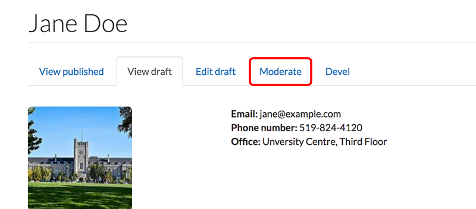
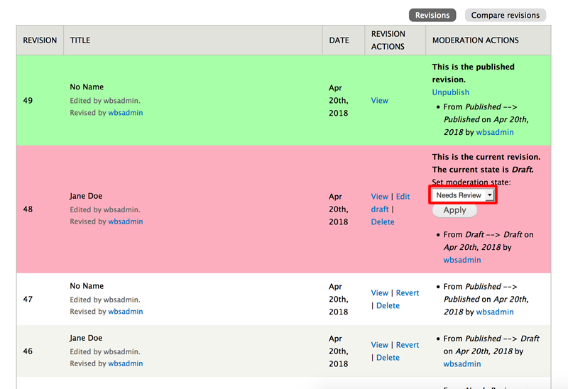
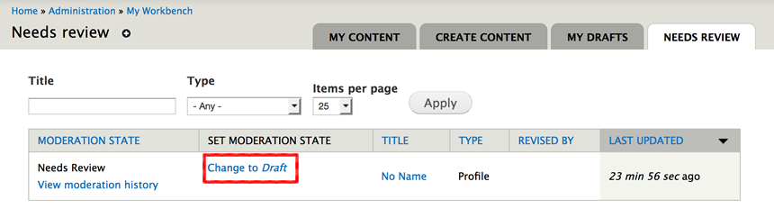

# People Profiles

The people profiles feature allows **Content Creators** to create and edit an organizational profile. Anonymous users can browse through these profiles in a listing page view and find more detail about a specific member of an organization by clicking on that member's name.

* [Using Taxonomy for People Profiles](howto-profiles.md#using-taxonomy-for-people-profiles)
* [How to Add People Profiles](howto-profiles.md#how-to-add-people-profiles)
  * [NEW: Tabbed layouts for People Profiles](howto-profiles.md#new-tabbed-layouts-for-people-profiles)
* [Customizing People Profiles Layout](howto-profiles.md#customizing-people-profiles-listing-page)
* [Workbench Moderations with People Profiles](howto-profiles.md#workbench-moderations-with-people-profiles)

## Using Taxonomy for People Profiles

Before creating a profile, it is suggested that the following taxonomy vocabularies are filled with terms. Otherwise, most of the people profile features will be unusable.

Add terms to the following:

1. **Area of research:** If applicable, you can describe the different areas of research for your department/users. This is optional. Example: _Molecular Interactions of Dihydrogen Monoxide_.
2. **Profile category:** This is a way to filter views. Example: _create a teaser view for specific departments within a college_.
3. **Profile field labels:** This is for adding extra field headings that are not already supported by the platform. Examples: _Interests, Office Extension, Favourite Colour, etc._
4. **Profile section labels:** Profile sections are used to separate and organize parts of the people profile. Examples: _Research, Education, Selected Publications, etc._
5. **Profile role:** Clients can create any number of positions/roles for their needs. Examples: _Staff, Faculty, Students, Co-op, etc._
6. **Profile unit:** This describes the title of the department or faculty an individual is a part of.
7. **Profile sub unit:** This is the sub-unit of a department. Example: _Web Business Solutions_ is a sub-unit of _CCS_.

### How to Add Vocabulary Terms

1. Using the administration bar, navigate to `Structure` &gt; `Taxonomy`.
2. You will see a long list of vocabularies. Seven of these vocabularies \(listed above\) are related to people profiles. Select `list terms` for the vocaubulary you would like to add terms to. 
3. From the vocabulary \(list of terms\) page, select `Add term`. 
4. Enter a name for the term. Enter a description if needed. 
5. Select `Save`. 

#### Taxonomy: Profile Field Labels

This vocabulary allows you to add custom fields to your people profiles. Add terms to this vocabulary to determine the field labels. For instance, if the field were to show "_Interests:_ Sports", then "Interests" would be a term in the `profile field labels` category.

After custom fields are created through taxonomy, they can be added through the "_PROFILE FIELDS_" section that appears when creating or editing a profile. The Label dropdown menu is populated with the terms from the vocabulary above. Fields will appear in the same order as they are entered, but can be reordered by dragging. Custom fields will always appear _after_ preset fields \(i.e. Email, Phone Number, Fax, Office, and Lab\).

Do not confuse this vocabulary with `profile section labels` vocabulary, which is used for adding larger sections that use the Drupal text editor.

## How to Add People Profiles

1. On the Administration bar, navigate to `Add Content` &gt; `Profile`.
2. Begin filling out the profile, starting with adding a **Preferred name** and **Last name**.
3. Many of the fields in the profile are optional, but it is recommended to add at least a name, role, and contact information.
4. Add any related **File** or **Image Attachments**. Remember to select `Upload` after choosing your file. 
5. If the member also has a `Website Link` then include a **title** and **URL**.
6. In order to add `Profile Sections`, select a value under **Heading** and enter any **Content** needed. Keep in mind that by clicking **Add another item**, you can add as many `Profile Sections` as you like.
7. Enter any _tags or keywords_ that help categorize and organize your people profiles.
8. Select `Save` when you are done.

### NEW: Tabbed layouts for People Profiles

If you used `Profile Sections` as per Step 6 above, all the values you filled in for **Heading** and **Content** will automatically be output in tabbed format as shown in the screenshot below:

Any content entered in the `Summary` and `Body` fields will remain as-is. If you have an existing profile where all the content and headings \(e.g. _Research_, _Awards_, _Publications_, etc\) were entered in the `Body` field, consider using `Profile Sections` instead if you'd like to get the new tabbed layout \(available as of [Release v27.2](https://github.com/ccswbs/hjckrrh/releases/tag/7.x-27.2)\)

## Customizing People Profiles Listing Page

You have the ability to change the size and alignment of the pictures on the people profile listing page, which is visible to site users. Follow these steps to customize your listing page:

1. Navigate to www.uoguelph.ca/sitename/people, or navigate to your people profiles page via your site menu. 
2. Select `Customize this page` at the bottom of the screen.
3. You will see the PP1 view pane in the `Left` section, similar to this image:

   

4. To change either the size or alignment of the images, first, delete the PP1 viewpane by selecting the trash can button. This will _not_ delete your people profiles.
5. Under the `Left` section, select `+` \(plus sign\). The "Add Content" window will open. 
6. In the side menu, select `View panes`. From the list of view panes, select `View: PP6 Custom Listing`. 
7. When the "Configure new View: PP6 Custom Listing" opens, check **ONE** of `Content: Image (Small Image)` or `Content: Image (Large Image)`. 
8. Check `Content: Align names` if desired. This will ensure that on the listing page, names with no image are aligned with other names, for a neater presentation.

   

9. Select `Finish`.
10. When the configuration window closes, make sure to select `Save` at the bottom of the screen. 
11. If you need to reconfigure the settings for the PP6 view pane, simply select the cog button at the top of the view pane. 

## Workbench Moderations with People Profiles

Workbench suite of modules provide additional functionality to Drupal content management.

The _People Profile Workbench Moderation Feature_ enables Workbench for People Profile content to enhance the existing publishing work-flow.

If you are unfamiliar with the _People Profile_ content type please visit the [How to work with People Profiles](howto-profiles.md) help documentation for more information.

Workbench moderation introduces the concept of **states** to Drupal content and then using permissions user roles determine who may change a content from one state to another and ultimately publish web pages.

### Publishing States

There are 3 publishing states for _People Profiles_ content.

* Draft
* Needs Review
* Published

Content may be in one of these states during the publishing process. Not until the content reaches the **published** state is it viewable publicly.

### Content State Transitions

Workbench uses roles to define publishing permissions. For People Profiles, two roles have been defined: the **author** and the **publisher**.

Content may move from one state to another. Below are the transitions permitted for _People Profile_ content and the required minimum role to perform transition.

| State transition | Required role |
| :--- | :--- |
| Draft → Needs Review | author |
| Needs Review → Draft | author |
| Needs Review → Published | publisher |
| Draft → Published | publisher |

The **author** role has permissions to create new profile content as drafts, create new drafts of existing content, and submit the draft content for review before publishing. The author may also 'take back' a **Needs Review** request and change the state back to draft.

The **publisher** role has permissions to review draft content that has been submitted for review and then publish the content.

It is worth noting that once a document is publish the Workbench workflow is complete. It is not possible to move published content back to draft.

## Using Workbench Moderation

In general, content edits \(or drafts\) will be created, submitted for review and then published. These activities along with the primary role responsible for each are listed below.

| Activity | Primary role |
| :--- | :--- |
| [Create draft](howto-profiles.md#create-draft-people-profile-content-author) | author |
| [Submit draft for approval](howto-profiles.md#submit-draft-for-approval-author) | author |
| [Approve draft and publish](howto-profiles.md#publish-document-site-editor) | publisher |

### Create draft People Profile content \(Author\)

Draft content is created by two methods.

1. The first is when new content is created. When a new people profile is created, it is by default set to a **draft state**.  Review [How to work with People Profiles](howto-profiles.md) help documentation for more information on creating new People Profile content.
2. The second is by editing existing content.

### Create new draft from existing content \(Author\)

1. Visit the people profile page you wish to edit. From the people profile page click the **New draft** tab to open the edit page.
2. Make changes to the page. Saving these changes will keep the page in the **Draft** state \(the default state for all new drafts\).
3. If the page is saved as a draft then the next time you visit the page the **New draft** tab will be replaced by 2 new tabs: **View Draft** and **Edit Draft**

   

4. Use the **View published** and **View draft** tabs to review changes in the content.
5. Use the **Edit draft** tab to edit the draft and make further changes to the content.
6. Save draft when edits are complete.

### Submit draft for approval \(Author\)

Once an Author's draft is complete they may submit it for review.

1. Click the Moderate tab to go to the moderation window:

   

2. The moderation window shows the current published page \(green\), the current draft \(red\) and past edits \(grey\). For the draft \(red\) there will be a drop-down menu. 'Needs Review' will be selected automatically in the drop-down menu.

   

3. Click **Apply** button. This will send a notification to the site editors that the draft is ready for review and needs publishing.

### Publish document \(Site Editor\)

1. Visit 'My Workbench'
2. Visit 'Needs Review' tab
3. Select page that needs review by clicking 'View Moderation History'
4. The current draft that needs review will be marked in red

   

5. click 'View' to see the review the draft.
6. If satisfied, return to moderate window by selecting the 'Moderate' tab

   

7. The state drop-down menu should already be set to **Published**.

   

8. Click **Apply** to publish the page. The Author will be notified that the document is published.

#### Note about rejected edits \(Publisher\)

Publisher drafts may be rejected. The Publisher may make edits to any draft, but if this happens, the Publisher takes ownership of the draft and the Author will not be able to make any additional changes.

To avoid preventing the Author from being able to make additional changes, the Publisher may notify the Author \(outside of Drupal, ie. email or phone\) to ask them to edit their "Needs Review" draft and then resubmit for review.

### Changing Needs Review to Draft \(Author\)

In the event a draft is rejected by a Publisher or an Author wishes to make additional changes to submitted draft, an Author may change the state of page from **Needs Review** back to **Draft**.

1. Select the **My Workbench** link from the black admin menu at the top of the page. This will open the My Workbench view.
2. From My Workbench click the **Needs Review** tab to show the list of pages sent for review.

   

3. From the **Needs Review** admin page, click the link **Change to** _**Draft**_ to set the page back to Draft.

   

4. Edit the draft as before. See [Create Draft](howto-profiles.md#create-draft-people-profile-content-author) section of help for more information.

