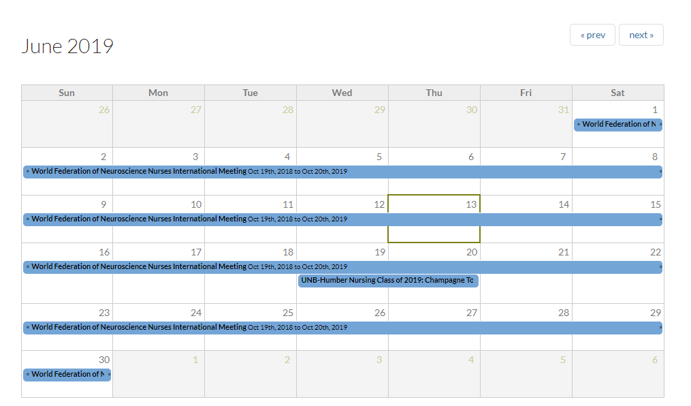
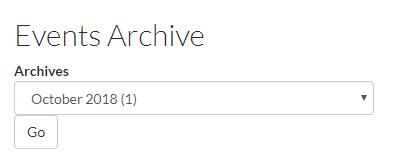

# Event Panes

### E1 - Listing page for multiple events: Upcoming events

With this view each featured event item displays the `Feature Image`, `Name`, `Date`, and some summary text. The summary text is the full `Summary` field of the event content item. If the `Summary` field is empty then a trimmed `Body` field \(600 characters\) is used.

### E3 - Upcoming events teaser list

With this view each featured event item displays the `Date`and the `Name` of the event.

### E9a - Weekly Calendar - List Format

With this view each featured event item displays the `Feature Image`, `Name`, `Date`, and some summary text by week. The summary text is the full `Summary` field of the event content item. If the `Summary` field is empty then a trimmed `Body` field \(600 characters\) is used.

### E8a - Monthly Calendar - List Format

With this view each featured event item displays the `Feature Image`, `Name`, `Date`, and some summary text by month. The summary text is the full `Summary` field of the event content item. If the `Summary` field is empty then a trimmed `Body` field \(600 characters\) is used.

### E8b - Monthly Calendar - Grid Format

With this view each featured event item displays the `Date`and the `Name` of the event in a monthly calendar.

### E1 - Listing page for multiple events: Event Archives

With this view each past featured event item displays the `Feature Image`, `Name`, `Date`, and some summary text. The summary text is the full `Summary` field of the event content item. If the `Summary` field is empty then a trimmed `Body` field \(600 characters\) is used.

### E5 - Browse events by date

With this view users can browse past events by month.

