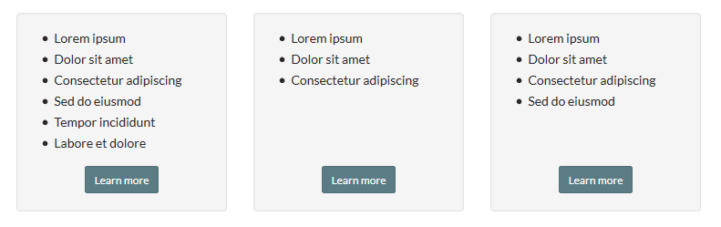

# Event Panes

  
E1 - Listing page for multiple events: Upcoming events

  

  
E3 - Upcoming events teaser list

  

  
E9a - Weekly Calendar - List Format

  

  
E8a - Monthly Calendar - List Format

  

  
E8b - Monthly Calendar - Grid Format

  

Tall

  
E1 - Listing page for multiple events: Event Archives

  

  
E5 - Browse events by date

  

