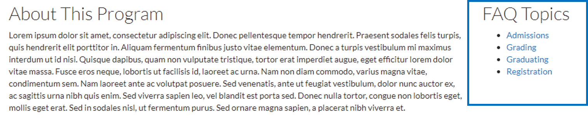

# FAQ Panes

### F1 - FAQ Listing

This view Displays the title of all FAQ content types in an alphabetical list view.

### F3 - Browse FAQ by Category

This view displays all FAQ categories as a list. You can find out more about categorizing content types in [Taxonomies](../basicbeginner/taxonomies.md#working-with-taxonomies) and the [FAQ categories](../ugcontenttypes/howto-faq.md#faq-categories) section.

