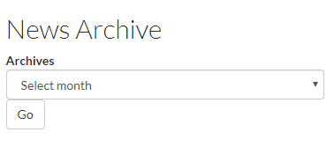

# News Panes

## N3 - Recent news teaser list: Content Pane with Image

## N3 - Recent news teaser list

## N4 - Recent news teaser \(bootstrap layout\)

## N4 - Recent news teaser \(bootstrap layout\): Content pane with Summary

With this view each featured news content item displays the `Feature Image`, `Title`, and some summary text. The summary text is the full `Summary` field of the news content item. If a the `Summary` field is empty then a trimmed `Body` field \(to 96 characters\) is used.

## N5 - Browse news by date

