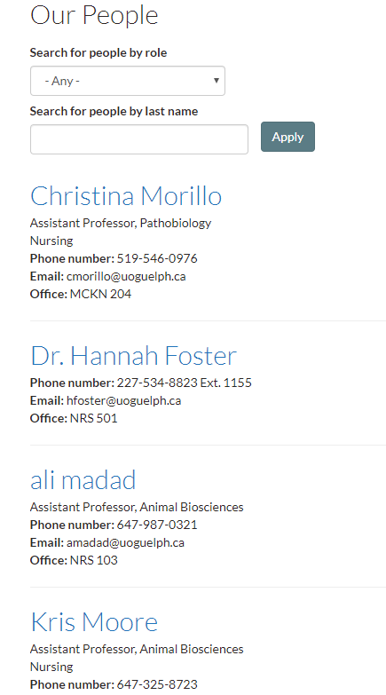
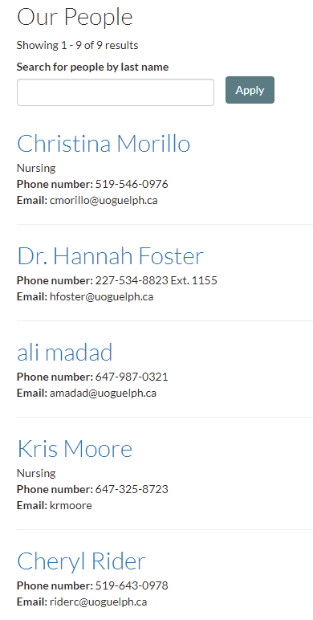
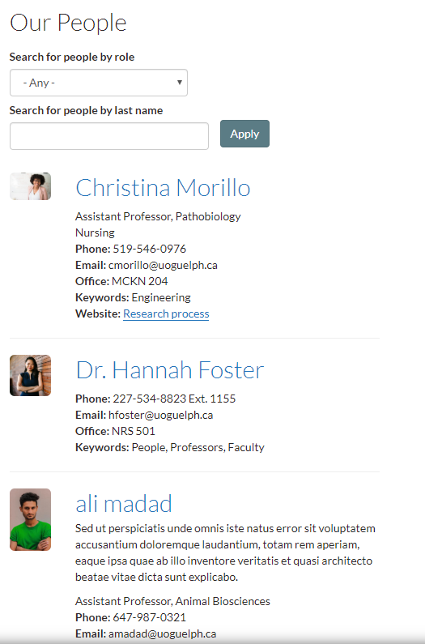

# People profiles

### PP1 - Listing page for multiple people profiles

With this view each featured profile is displayed with the profile `feature image`, `Full name`,  `position/title`, `unit`,  `Phone number`,  `E-mail`, and `Office` . This view is searchable by role and/or last name.

### PP1 - Listing page for multiple people profiles: No pictures

With this view each featured profile is displayed with the `Full name`,  `position/title`, `unit`,  `Phone number`,  `E-mail`, and `Office` . This view is searchable by role and/or last name.

### PP1B - Listing page \(grid view\)

With this view each featured profile is displayed with the `Featured  image`, `Full name`,  and `Role(s)` with an overlay. This view is searchable by last name.

### PP5 - People profile listing filtered by keyword

This view is used to display categorized people profiles. It shows the profiles `Feature image`, `Full name`, `Unit`, `Phone number`, `Email`, and `Office`. visit [categorizing and displaying profiles](../advancedguide/howto-categorizeanddisplayprofiles.md) for more information.

### PP5 - People profile listing filtered by keyword: No pictures

This view is used to display categorized people profiles. It shows the profiles `Full name`, `Unit`, `Phone number`, and `Email`. You can also select which of the listed options you would like to be displayed. visit [categorizing and displaying profiles](../advancedguide/howto-categorizeanddisplayprofiles.md) for more information.

### PP6 Custom Listing

With this view each featured profile is displayed with the profile `feature image(Large or Small)`, `Full name`,  summary, `position/title`, `unit`,  `Phone number`,  `E-mail`, and `Office`  by default. You can also choose to display the `body` section,  `website links`, and `keywords` or disable some of the default fields that are displayed. If a profile doesn't contain a feature image there is an option available that will align the name with the other profile names so it looks uniform, it's called `Align names` . This view is searchable by role and/or last name.

### PP7 - People profile teaser list \(block image\)

With this view the featured profiles display the profiles `Full name`, `Feature image` and the full`summary` below.

### People profile teaser list \(inline image\)

With this view the featured profiles display the profiles `Full name`, `Feature image` and the full`summary` on the right.

