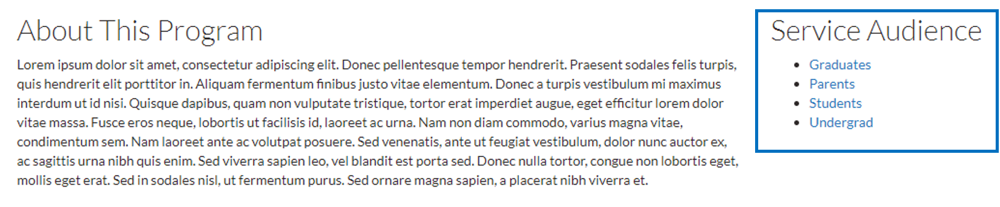
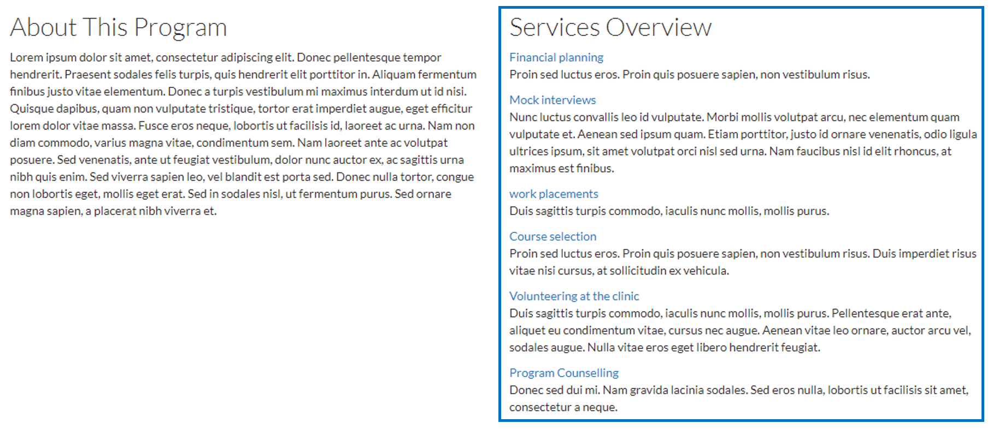

# Service Panes

### SR4 - Services by Audience

This view displays all service audiences so visitors can easily find services offered to them. You can add service audiences in Structure &gt; Taxonomy &gt; Service audience. Find out more about categorizing content types in [Taxonomies](../basicbeginner/taxonomies.md#working-with-taxonomies).

### SR6 - Services by Keyword

With this view each service item displays the `Name`, `Description`, and some summary text. The summary text is the full `Summary` field of the event content item. If the `Summary` field is empty then a trimmed `Body` field \(600 characters\) is used.

### SR8 - Service Category Teaser List

This view displays all service categories. You can add service categories in Structure &gt; Taxonomy &gt; Service category. Find out more about categorizing content types in [Taxonomies](../basicbeginner/taxonomies.md#working-with-taxonomies).

